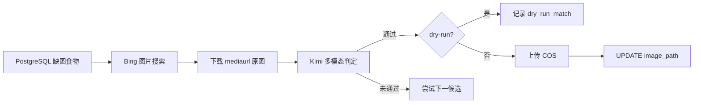

# food_link Go 后端

本目录为微信小程序 `food_link` 的 Go 后端服务（Gin + GORM + PostgreSQL），配置见 `config.yaml` / Apollo，本地开发说明见仓库根目录 `CLAUDE.md`。

本文档重点说明 **标准食物库缺图回填**（`cmd/standard-food-image-backfill`）的数据来源、流程与落库方式。

---

## 业务目的

标准食物营养库 `food_nutrition_library` 中部分条目只有营养素数据、**没有展示图**，手动录入页、搜索联想等场景体验较差。回填工具的目标是：

1. 为缺图且有效的标准食物自动寻找一张**可公开展示**的菜品实拍图；
2. 经多模态模型校验（食物主体匹配、无大面积水印）后，上传到对象存储；
3. 将 COS 对象键写入数据库，由现有 CDN 逻辑拼出访问 URL。

该流程为 **离线批处理 CLI**，不经过 HTTP API；默认 **dry-run**（只搜图、判定、写日志，不上传、不改库）。

---

## 涉及的数据库

### 主表：`food_nutrition_library`

| 字段 | 类型 | 说明 |
|------|------|------|
| `id` | uuid | 食物主键 |
| `canonical_name` | text | 展示名（搜索与 Kimi 判断依据） |
| `normalized_name` | text | 规范化名 |
| `image_path` | text | **主展示图**：COS 对象键（非完整 URL） |
| `image_paths` | jsonb | 图片键列表；回填成功时写入单元素数组 |
| `kcal_per_100g` 等 | numeric | 营养素；缺图查询要求 `kcal_per_100g > 0` |
| `is_active` | boolean | 仅处理 `true` |

迁移定义见 `internal/migration/do/schema_do.go`（`FoodNutritionDO`），幂等 SQL 见 `internal/migration/migration.go`（`image_path` / `image_paths` 列）。

### 关联表：`food_nutrition_aliases`

可选别名，用于扩展 Bing 搜索词（`canonical_name` 优先，再尝试「名称 + 美食」等变体）。

### 选取条件（缺图）

CLI 查询与 `updateFoodImage` 更新均要求：

- `image_path` 为空；
- `image_paths` 中不存在非空 URL/键；
- `is_active = true` 且 `kcal_per_100g > 0`。

满足条件的行才会进入回填队列。`--apply` 写库时再次用相同条件 **幂等**，避免覆盖已有图。

### 对象存储

- Bucket：`food-images`（配置 `storage.food_images_bucket`）
- 对象键前缀：默认 `standard-food/backfill/{food_id}/{sha256}.jpg`
- 访问 URL：由 `storage.BuildAccessURL` / CDN 基址生成（写入前在结果里可预览 `access_url`）

### 与业务读链路的关系

手动食物/标准食物列表在 `internal/utility/repo/manual_food_repo.go` 中将 `image_path` / `image_paths` 映射到前端字段，小程序通过 CDN 展示标准食物图。回填只写 **对象键**；运行时由既有存储模块解析为 HTTPS 地址。

---

## 端到端流程



1. **加载配置**：`--config-dir` 指向 `backend/`，连接 Apollo/本地库。
2. **拉取任务**：按 `limit`/`offset`、`--food-id`、`--food-ids` 或断点状态筛选食物。
3. **Bing 搜图**（默认 `--image-search bing`）：见下文「Bing 取图逻辑」。
4. **下载候选**：每张图带 `Referer`（优先来源页 `purl`，否则 Bing 搜索页）。
5. **Kimi 判定**：模型默认 `kimi-for-coding`；需 `food_match`、`no_watermark` 且 `confidence >= threshold`（默认 0.72）。
6. **落库/上传**：仅 `--apply` 时上传 COS 并 `UPDATE`；默认 `--dry-run` 只输出 `dry_run_match`。
7. **断点续跑**：`--output-dir` 下 `state.json`、`results.jsonl`、`failed.jsonl` 记录进度。

---

## Bing 取图逻辑（与历史 Python 脚本一致）

实现文件：`cmd/standard-food-image-backfill/bing_search.go`

- 请求：`GET https://cn.bing.com/images/search?q={关键词}&first={偏移}`  
  - 每页约 35 张，最多翻 4 页（`first = 1, 36, 71, …`）。
- 解析：HTML 中每个 `<a class="iusc">` 的 `href`，提取查询参数 **`mediaurl`**（即页面展示用的原图 URL；兼容旧写法 `split('&')[4][9:]`）。
- **不使用** Bing async 接口，**不优先** `turl` 缩略图，避免与用户浏览器网格不一致或误匹配。
- User-Agent 与历史 Python 爬虫一致（Chrome 84）。
- 可选从同标签 `m` 属性读取 `purl`，仅用于下载 Referer，不改变取图 URL。

备选：`--image-search google` 走 opencli + Chrome（需本机 opencli，适合调试，生产批处理推荐 bing）。

---

## Kimi 鉴权

优先级（见 `main.go`）：

1. 环境变量 `KIMI_API_KEY`
2. 文件 `--kimi-api-key-file`（默认 `tmp/kimi-api-key.local`，模板见 `kimi-api-key.local.example`）
3. OAuth 设备码令牌 `tmp/kimi-code-oauth-token.json`（`--auth-only` 获取）

**勿将 Key 提交仓库**；`tmp/` 已在 `.gitignore` 中忽略。

---

## 常用命令

在 `backend/` 目录执行：

```bash
# 单条缺图食物，dry-run（默认，不落库）
go run ./cmd/standard-food-image-backfill --config-dir . \
  --food-id "<uuid>" \
  --image-search bing \
  --search-query-limit 1 \
  --force-reprocess \
  --timing \
  --kimi-api-key-file tmp/kimi-api-key.local

# 指定多条
go run ./cmd/standard-food-image-backfill --config-dir . \
  --food-ids "uuid1,uuid2,uuid3" \
  --output-dir tmp/standard-food-image-backfill-batch \
  --dry-run

# 正式写库 + 上传 COS
go run ./cmd/standard-food-image-backfill --config-dir . \
  --limit 100 \
  --apply \
  --workers 4 \
  --kimi-api-key-file tmp/kimi-api-key.local

# 仅 OAuth 登录
go run ./cmd/standard-food-image-backfill --config-dir . --auth-only
```

### 主要参数

| 参数 | 默认 | 说明 |
|------|------|------|
| `--dry-run` | true | 为 true 时不传 COS、不 UPDATE |
| `--apply` | false | 与 dry-run 互斥；开启后写库 |
| `--max-candidates` | 8 | 每条食物最多下载判定张数 |
| `--threshold` | 0.72 | Kimi 置信度下限 |
| `--output-dir` | `tmp/standard-food-image-backfill` | 状态与结果目录 |
| `--force-reprocess` | false | 忽略 state 中已完成记录 |
| `--workers` | 1 | 并行 worker 数 |

### 结果状态

| status | 含义 |
|--------|------|
| `dry_run_match` | 判定通过，未上传/未写库 |
| `db_updated` | 已上传并更新 `image_path` |
| `no_match` | 候选均未通过 Kimi |
| `search_failed` | Bing 无候选 |
| `download_failed` / `kimi_failed` | 下载或 API 失败 |

---

## 相关命令与脚本

| 路径 | 说明 |
|------|------|
| `cmd/standard-food-image-backfill/` | 主回填 CLI |
| `cmd/manual-food-image-audit/` | 手动食物库缺图审计（只读统计） |
| `scripts/audit_manual_food_image_coverage.py` | 覆盖率审计脚本 |
| `kimi-api-key.local.example` | 本地 Key 配置模板 |

单元测试（Bing 解析）：`go test ./cmd/standard-food-image-backfill -run TestBing -count=1`  
需联网 live 测试：`BING_SEARCH_LIVE=1 go test ./cmd/standard-food-image-backfill -run TestSearchBingImagesLive -v`

---

## 批量运行（1 万+ 条）

1. 基线：`.\scripts\backfill-baseline.ps1`
2. 配置 `tmp\kimi-api-key.local`（见 `kimi-api-key.local.example`）
3. 试跑：`.\scripts\backfill-phase1-dryrun.ps1`
4. 持续分片：`copy data\standard-food-image-backfill\scheduler.example.json scheduler.json` 后反复执行 `.\scripts\backfill-run-next.ps1`

详细手册：[docs/standard-food-image-backfill-runbook.md](docs/standard-food-image-backfill-runbook.md)  
数据目录：[data/standard-food-image-backfill/README.md](data/standard-food-image-backfill/README.md)

## 其它文档

- API / 路由迁移：`docs/backend-api-prd/`
- E2E 契约测试：`e2e-test/README.md`
- 数据库迁移执行：`go run ./cmd/migration -config-dir .`（改表结构须先改 `internal/migration/do` 再跑迁移）
