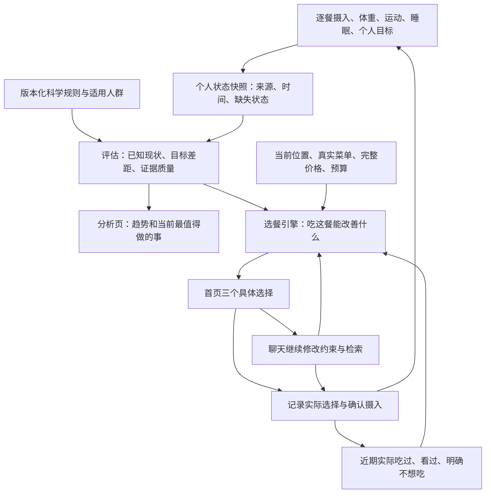

# 食探饮食决策 v2：科学依据、去重复与分析页接入规格

日期：2026-10-07。状态：**源码审计与升级提案，未实施、未发布，不是已验证的产品功效**。

2026-10-08 更新：第一阶段已经在 dev 部分实施，能力和限制以 [v2.1 实现说明](foodlink-diet-decision-v2-implementation.md) 为准；本稿未落地部分仍是提案。用户最新明确运动先不做、当前统一健康优先并补微量营养，新增 [营养目标优化补充规格](foodlink-diet-decision-v2-nutrient-objective.md)，不把现有宏量评分宣传为完整个体营养模型。

本稿是在《食探个体化健康决策架构 v2 设计稿》基础上的饮食专项细化。依据本次用户粘贴的完整讨论、当前 dev 源码和下列一手文献形成。旧对话中的设计意向不作为当前实现或部署证据。本轮没有做小马哥账号的新的连续首页回放；以下重复原因是源码证据，不是对其每次请求日志的追溯结论。

## 1. 结论与现有问题

目标不是每天随机换三个菜，而是：在真实能找到的餐食中，结合个人目标、逐餐摄入、实际位置和反馈，持续提供有区别、可执行、有依据的选择；分析页和聊天共用同一份目标与事实。

| 当前实现 | 造成的限制 | 源码定位 |
| --- | --- | --- |
| 首页重新 POST preview，但后端使用确定性候选评分、稳定排序 | 数据和候选相近时，重复请求仍会得到同一批高分菜；不能只归因于前端缓存 | `NextMealRecommendations.tsx`、`meal_preview_service.go:26/236` |
| 有近 30 天饮食频次、近 3 天吃过惩罚；没有首页实际曝光、拒绝、采纳反馈进入排序 | “没吃过但已推荐十次”不会被识别；点击也不能代表吃过 | `meal_preview_service.go:220` |
| 无 GPS 的学校查询按蛋白质等排序后先截取 100 条；GPS 查询已有商家穿插，但最终仍固定按距离/ID等分页 | 学校分支偏向高蛋白菜单；两条路径都有有限候选窗口，后续个性化看不到窗口外的菜 | `stats_repo.go:225`、`diet_nearby_repo.go:15` |
| 去重主要是餐食名称/条目指纹，分散主要到商家或食堂 | 同类盖饭换名字仍可能重复；一个大食堂中的不同窗口可能未被充分利用 | `meal_preview_service.go` |
| v1 健康计算以能量、蛋白、碳水、脂肪为主；55%健康匹配＋30%可执行性＋15%资料可信度是工程权重 | 不是经过验证的整体健康模型；不代表皮肤、心血管或力量改善概率 | `diet_decision_engine.go:169` |
| 自定义力量/皮肤关注另行评分，没有完整地作为首页目标输入 | 用户改变健康关注，不必然改变首页选餐 | `meal_recommendation_harness.go`、`custom_focus.go` |
| 力量分混入记录完整度；填写作息提高恢复分；出现皮肤描述提高 directScore | 资料变完整与身体变健康混淆 | `custom_focus.go:688/712/781/790` |

补充：聊天成功模型分支目前可以自行选择真实候选 ID，再由引擎校验和评分；不是所有路径都由引擎选出全局最优三餐。现有逐餐读取、公开大学查询、完整点单费用护栏保留。不会回退为仅 7 天摘要，也不会重新加入“只能查本人学校”的限制。

## 2. 科学模型不是越多越好：分层且有适用条件

下表是拟接入的证据与用途，不表示当前已完整实现。营养指南、膳食评价工具、临床研究和工程排序方法属于不同层次，不能把名称加在一起就称为临床验证。

| 依据 | 系统中的具体用途 | 适用条件和限制 |
| --- | --- | --- |
| 中国居民膳食指南（2022）[S1] | 默认膳食结构基线：食物种类与搭配，蔬菜、水果、全谷物、豆奶等组成；影响一周结构与下一餐选择 | 面向适用人群的膳食指导，不是“每道菜都必须满足一天全部目标”；食物多样性不是菜名数量 |
| 中国居民膳食营养素参考摄入量（2023）[S2] | 按年龄、性别、生理阶段等建立适用的营养参考；统一分析、首页、聊天的单位与目标来源 | 本轮核验发布和用途，未完成全部原始数值表的逐项核录；上线前须审校具体表格、适用人群及营养素形态，不能凭模型记忆补数 |
| CHEI 中国健康膳食指数 [S3] | 为分析页的膳食质量分项提供可复现框架；将可改善的食物结构缺口传给选餐 | 原研究基于 2016 版指南，17 个组成部分；不是身体健康诊断。改用 2022 指南或缺少部分字段后，不能仍声称是原版完整 CHEI |
| DASH 膳食模式 [S5] | 对相关目标且适用的用户，参考整套食物搭配和钠等规则，而非单看热量 | 不是所有用户自动套同一低钠目标；疾病、肾功能、用药等特殊情况需专门规则和专业评估，不自动提供治疗处方 |
| 地中海膳食及 PREDIMED 研究 [S6] | 可参考植物性食物、豆类、鱼、坚果等整体模式，用本地餐食实现相应结构 | 引用 2018 重分析版本；研究人群为心血管高风险中老年人，不能直接宣传大学生吃一餐便能获得同等收益 |
| 运动营养共识 [S7] | 对符合条件的运动用户，根据体重、实际训练、全天摄入规划蛋白和供能 | 2017 ISSN 是可用依据之一，不冒称最新唯一标准；高蛋白不是越多越好，不作为所有人的默认量或皮肤评分依据 |
| 精准营养研究方向 [S8] | 后续在有可靠个体反应数据时校准建议 | NIH 项目研究个体对食物的差异反应；不是 FoodLink 已具有代谢预测能力的证明，不能无血糖等测量却声称预测个人餐后反应 |

与本项目很贴近的案例：[S4] 使用高校食堂智能点餐数据、补充食物频率问卷与 CHEI 评价膳食质量。它支持我们探索“实际餐食数据→膳食结构评价”的方法，但没有验证 FoodLink，也没有证明点餐等于实际吃完，或食堂记录等于全部摄入。

### 2.1 必须纠正旧讨论中的过度简化

- RNI/RDA 用于计划时的参考，不应被直接当成“当天低于此数就营养缺乏”的诊断阈值。评估涉及通常摄入、日间变异和个体需要。[S9]
- AI 是证据不足以建立相应需要量分布时的参考；低于 AI 本身不能定量判定不足。UL 不是推荐目标，也不是通用于所有营养素、所有来源的一餐硬上限。[S9]
- 不能为所有微量营养素套同一条所谓“科学 U 型风险曲线”。拟合/惩罚函数是产品工程选择，不是自动拥有疾病风险意义。
- 未记录不等于没吃，未知含量不等于 0。只有部分餐食记录时，展示“已记录摄入”，不能宣称已掌握实际全天摄入。
- 当前价格、距离、可信度的人工分数不能解释成真实成功概率；引用指南也不能把 55/30/15 这些产品权重包装成指南公式。

### 2.2 科学规则的最小合同

每条可执行规则必须具有：

```text
rule_id / rule_version / evidence_ids / reviewed_at
applies_to（年龄、生理状态、目标、排除条件）
metric / unit / basis（每100g、每份、可食部、生重/熟重）
reference_type（食物组建议、EAR、RNI、AI、UL、目标范围等）
time_window（本餐、当日规划、多日通常摄入、长期趋势）
source_scope（食物、补剂、总来源；适用的营养素形态）
calculation / required_inputs / missing_data_behavior
evidence_type / evidence_limitations / approval_status
```

不是读过文献就自动启用：文献核验→结构化规则→数值/单位审校→适用人群审查→回放验证→版本发布。没有合格规则的“抗衰、美白”等自定义目标可以保留为关注主题，但不能自动生成貌似专门验证过的分数。

## 3. 三个入口共用同一份事实，但分别回答不同问题



- 快照包含 `snapshot_id`、截至时间、用户时区、当天逐餐记录和多日趋势；补录历史一餐按实际进餐日期影响该日及相应窗口，不改成今天。
- 目标生成器输出 `policy_version` 和本轮适用规则；同一数据与规则版本下，首页、聊天、分析不得采用互相冲突的营养目标。
- 位置分清实时 GPS、用户本轮指定目的地、历史常驻学校；明确询问北大就检索北大，不用常驻清华覆盖。没有有效位置时不虚构距离或“就在你附近”。
- 所有大学公开菜单可检索；能看到菜不等于已验证当天供应、校门通行或付款方式，不据此硬拒绝检索，也不保证能进校就餐。
- 多个健康关注共享底层指标，避免“增肌＋力量”把同一蛋白缺口重复加分；主次目标和不可违反条件分开表达。

## 4. 首页去重复：不是加一个随机数

### 4.1 先扩大有效选择，再排序

1. 保留当前位置和学校查询；在预算、餐段、独立可点的主餐等条件下，分商家/食堂/窗口、主食与主要食材类型召回候选。
2. 避免首页无目标地先取“蛋白最多的 100 道”；使用有界、多路召回与必要翻页，记录实际检索范围和截断，不宣称全库最优。
3. 候选归一化包括菜品 ID、同菜别名、窗口、主要食材、烹调方式、整餐/配菜属性、必选费用；不能仅靠标题是否含“鸡肉”或“米饭”判断全部重复。
4. 核对完整点单价格和适用份量；未知锅底/最低起点费用不能算作已满足预算。没有当天营业与库存数据时只称库内已收录，不承诺实时供应。

### 4.2 维护两种不同的记忆

| 记忆 | 用途 | 不能推断什么 |
| --- | --- | --- |
| 实际摄入：某天某餐吃了什么、份量与来源 | 计算当天规划余量和多日膳食结构；降低近期同菜重复 | 不能从推荐、点击或收藏生成摄入 |
| 推荐反馈：真正看到哪张卡、换一换、明确拒绝及原因、选择 | 防止重复轰炸，识别本餐与长期偏好 | 没点击不等于不喜欢，没记录不等于没吃 |

只在卡片真正显示后记曝光；轮播中尚未出现的第二、第三张不算看过。事件以 recommendation_id、option_id 和幂等键去重，刷新不应无限放大负反馈。反馈范围需区分“这餐不想吃”“暂时吃腻”“长期忌口”；拒绝原因优先使用用户明确表达，不强迫填写。

### 4.3 组合选择的职责

- 先处理已知过敏、明确忌口、预算等约束。未知配料不能当安全已验证，缺少合适候选时明确说明，不能用新鲜感抵消安全要求。
- 对可行候选计算：对当前营养/食物结构差距的帮助、偏好匹配、完整费用、可达性、证据不足与重复代价。
- 三张卡一起选，既考虑各自合适，也避免全是同类拌饭或同一窗口。至少两个附近选项是有足够合格数据时的目标；历史最多一个，最好能关联真实可找到的商家，否则不强凑历史名额。
- 同一餐、同一条件的重复刷新保持稳定；明确换一换、日期/餐段变化、新摄入或位置变化后重新选择。可行选择很少时允许诚实重复，不能为轮换推荐明显更差或买不到的餐。
- 初版使用可解释的约束筛选与组合多样性重排即可。权重属于待校准的产品参数，不标成临床模型。Pareto 前沿可用于保留预算/营养/距离各有优点的选择，但不是必须先引入的系统，也不是疾病疗效证明。
- 暂不宣称模型预测控制、个人因果优化或强化学习已运行。先有可靠时间序列与反馈，再决定是否值得做学习排序/受约束探索；不能用用户健康作无约束试验。

## 5. 数据资产怎样真正参与推荐

首批应审计而非假设已齐备：

| 数据 | 最小要求 | 缺失时的降级 |
| --- | --- | --- |
| 地点与菜单 | 来源ID、商家/学校/食堂/窗口、坐标精度、最近核对时间 | 不冒充精确步行距离或即时可售 |
| 份量与价格 | 售卖单位、可选份量、整餐属性、必选项与费用、价格更新时间 | 标注价格/完整费用待确认，不承诺满足硬预算 |
| 营养 | 宏量、需要时的纤维/钠等，单位、份量基准、计算来源 | 无证据不写“低钠”“纤维足”；未知值不能作为健康优势 |
| 膳食结构 | 可核对的食材、食物组及数量、混合菜拆分、油盐糖证据 | 可以给有限食物组线索，不能硬算完整 CHEI 分数 |
| 点单依赖 | 主餐/配菜、锅底/最低起点、可单买与组合关系 | 继续排除把火锅配菜拼成便宜整餐的情况 |
| 用户反馈 | 有效曝光、拒绝、接受、确认吃过分开 | 没有反馈先不声称学到了喜好 |

菜品结构/点单语义可用大模型辅助提取，再用可审计的结构化规则校验；不能仅靠固定关键词不断打补丁。模型推断与人工核实必须可区分。当前候选对象主要输出宏量，库中某处可能有微量字段不等于首页排序已经消费它们。

推荐可解释记录应至少保存：快照/规则/候选集版本、采用和缺失的证据、最终候选ID、主要排除原因、计算出的目标差距、选择理由与反馈关联。健康数据和位置只记录必要范围，按原有权限管理，不能写入普通请求日志或公开宣传素材。

## 6. 分析页先纠正指标含义，再决定视觉布局

默认只呈现三层：

1. **实际变化**：已记录的体重趋势、训练成绩/负荷、饮食结构。没有直接测量的目标显示暂无充分证据，而非默认 58 分。
2. **现在最值得改善的 1–3 件事**：从可计算的差距产生优先项，不泛泛重复“均衡饮食”。部分记录时明确限定为已记录部分。
3. **下一步行动**：关联附近可找到的具体餐食，或适用的记录/训练行动；点击进入已有首页/聊天继续调整，而不是新做一套脱节推荐。

数据覆盖、估算比例、时效、缺失项放在可展开的“依据”中，独立于表现分。填写更多资料可以增加评估把握，不能直接被解释为皮肤变好、力量增长。

CHEI 原版只有在所需数据与原方法都满足时才展示对应总分；未满足时显示可核对的分项，或明确命名为“食探膳食结构参考”，不得静默删项再按百分比冒充原版。既有健康总分及自定义关注的历史需要带评分版本，改算法造成的跳变标注为口径变化，不当作身体突然改善。

首页仍保持用户已选定的简洁形式：**三个可滑动具体餐食，菜名＋去哪里吃＋价格/份量，聊聊这餐**。若加一句理由，只放一个最关键原因；完整模型名称、计算过程和文献放到“为什么推荐/科学依据”的二级内容中，不增加大段小字、重复宠物或“附近可选/历史回选”标签。

## 7. 能宣传什么，不能宣传什么

建议区分“方法依据”“实际上线能力”“产品效果证据”三张清单，并显示版本与更新时间。

- 当前可核实的描述：结合已记录饮食、个人目标和位置检索已收录餐食，并进行匹配与点单约束检查。
- **只有对应功能上线并验证后**，才可使用：以中国膳食指南和营养参考为依据，结合你的逐餐记录、位置与反馈，帮助你在附近找到更合适的下一餐。
- 不应把研究直接变成产品功效：不能说产品已获 CHEI/NIH 认证、临床证明抗衰、精确预测个人代谢，或每次推荐都是全球最优。
- 科普可解释为什么不只数卡路里、为何要看一段时间的食物结构、为何低于参考量不等于缺乏；每个结论链接具体指南/研究和适用边界，而不是只堆机构 Logo。

## 8. 分阶段实施和验收

| 阶段 | 可交付结果 | 验收重点 |
| --- | --- | --- |
| A 首页有效选择与反馈 | 修正候选截断偏差、同菜/同类去重、曝光/明确拒绝记忆、稳定轮换；保留既有卡片 | 有充分候选时，连续多餐不固定相同组合；换一换不回填本轮拒绝；没有替代时如实说明 |
| B 共用科学规则与状态 | 首页/聊天/分析采用同一目标合同；落首批经审校规则、证据缺失处理 | 改位置、预算、已吃餐食、训练状态时有相应变化；安全/价格/单位不因个性化失效 |
| C 分析行动化与透明依据 | 表现与证据分离，指标→真实餐食/行动；版本化历史，二级科学依据 | 同一快照指标一致；补资料不凭空改善身体分；算法升级不伪装成健康进步 |
| D 校准与长期效果 | 基于明确反馈调整排序，评估膳食结构和可执行性；必要时做经适当设计的效果研究 | 不仅看点击率；区分采纳、确认摄入、结构变化和因果健康效果 |

验收需覆盖：同地点连续三天、同一天多次打开、午餐补录后晚餐、清华→北大、刚训练＋预算变化、明确拒绝同类餐、没有 GPS、附近候选不足、营养未知、火锅必选费用不明。用固定快照检查决策差异，并最终在真实微信运行时检查三张卡及聊天衔接，不以单元测试通过替代用户体验。

记录重复曝光率、同类集中度、有效候选覆盖、明确拒绝后的重复率、完整费用可信度、确认采纳情况、响应延迟；按可行候选丰富度分组，不用“附近只有一道菜”的案例虚假拉低指标。先测基线再设改善阈值，不捏造 80%/95% 等效果目标。

实施优先复用现有 health domain/repo/service、preview、chat 和 stats 接口，不先拆微服务或堆多 Agent。本稿未修改业务、计费、数据库和 UI；如后续需要反馈表，必须先落迁移 DO/幂等迁移，并确认目标库，不能用临时 SQL 当上线方案。沿用现有手动分析成功生成的计费规则。

## 9. 一手参考资料

- [S1 中国营养学会：2022 膳食指南核心工具包](https://www.cnsoc.org/activitykit2/6522002010.html)
- [S2 中国营养学会：2023 版 DRIs 发布说明](https://www.cnsoc.org/acadconfn/792310200.html)；[DRIs 原始表入口](https://www.cnsoc.org/drpostand/)
- [S3 CHEI 开发原始研究，2017](https://pubmed.ncbi.nlm.nih.gov/28872591/)
- [S4 食堂点餐数据＋补充问卷＋CHEI 高校研究，2022](https://pubmed.ncbi.nlm.nih.gov/35267987/)
- [S5 NIH/NHLBI：DASH Eating Plan](https://www.nhlbi.nih.gov/health/dash-eating-plan)
- [S6 PREDIMED，2018 重分析版本](https://www.nejm.org/doi/full/10.1056/NEJMoa1800389)
- [S7 ISSN：Protein and Exercise，2017](https://link.springer.com/article/10.1186/s12970-017-0177-8)
- [S8 NIH Nutrition for Precision Health：研究目标与范围](https://commonfund.nih.gov/nutritionforprecisionhealth)
- [S9 National Academies：Using Dietary Reference Intakes for Nutrient Assessment of Individuals](https://www.ncbi.nlm.nih.gov/books/NBK222891/)

检索日期：2026-10-07。以上为本次相关依据核对，不声称已做覆盖所有最新研究的系统综述。完整 DRIs 表格、具体人群阈值和规则数值上线前仍需逐项审校。
