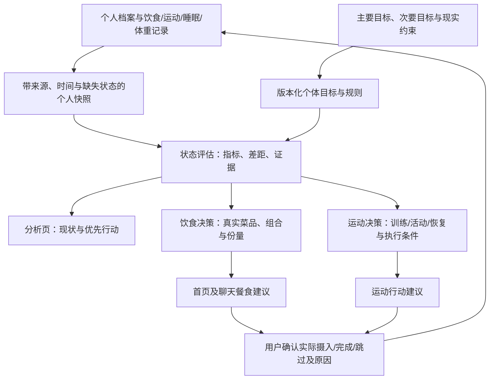

# 食探个体化健康决策架构 v2 设计稿

状态：2026-10-07 源码核对后的架构提案；不是已实现或已发布能力。用户提出首页推荐餐食、分析指标及运动都应按个人情况进行决策。本稿落实输入、模块边界、指标与接入顺序，不修改现行业务代码。

2026-10-08 范围覆盖：用户明确**运动先不做**。当前优先饮食与分析共用的健康优先、微量营养和动态状态决策，详见 [营养目标优化补充规格](foodlink-diet-decision-v2-nutrient-objective.md)。下文运动行动模块仅保留为未来架构，不属于当前实施范围；现行 v2.1 已部分实施的目标/反馈/分析能力以独立实现说明和最新源码为准，不沿用本稿旧审计作当前状态。

## 1. 用户需求与系统分工

首页回答下一餐怎么选；分析页回答当前已知状态、离目标的差距及优先行动；运动模块回答本次消耗和今天适合的运动行动。三个入口共享用户状态、目标和规则版本，领域计算分别实现。

同一用户的同一数据快照应产生相同评估；首页与聊天可因定位/预算/临时偏好不同产生不同方案，但必须说明本轮条件改变。

## 2. 当前底座

- 首页已有 previewMeals → PreviewMeals → hybridMealRecommendation，调用v1引擎过滤、评分，并加入距离/近期重复/学校/偏好等排序项。
- 聊天有真实餐食检索、排名、比较、组合和硬约束校验；成功模型分支保留模型选择，引擎只对子集分配角色。
- 分析有结构化宏量、微量、运动摘要、体重/饮水等统计；custom_focus独立计算力量和皮肤的目标支持分，没有把全部个体目标传入首页。
- ExerciseService已读取最新体重、年龄、性别、身高、活动水平、BMR/TDEE估算运动主动消耗；不等于已有运动计划优化器。
- 三模块的目标/营养参考/证据规则尚未统一；v1没有完整多健康目标冲突优化。

## 3. 个人快照与目标

建议内部共用快照，不为共用代码新增独立微服务：
- 身体条件：年龄、性别、当前体重及测量时间、身高、已确认生理条件。
- 目标：主目标、次目标、优先级、时间跨度、直接进展指标。
- 已知状态：今日确认摄入、滚动周食物分布、近期运动及训练负荷、实际睡眠/恢复、体重趋势。
- 环境：有效位置、真实可选菜单、完整价格、预算、可用时间、器械与训练经验。
- 约束：过敏、忌口、用户明确限制、已确认伤病或专业人员设置的边界。
- 每项字段携带value/unit/source/observed_at/quality；未记录、缺字段、估计值和真实0分别表达。

营养目标按已核验参考规则和个人条件生成；规则必须保留来源、适用人群、目标区间、过量边界、计算方法、版本。不得把同一份普通成年人固定值当所有用户的个体目标。

## 4. 分析页的指标合同

| 类别 | 建议首批指标 | 如何解释 | 如何影响决策 |
| --- | --- | --- | --- |
| 饮食基础 | 能量区间、蛋白质g及g/kg、脂肪/碳水、膳食纤维、食物多样性 | 已记录量、个体目标范围、差距、数据覆盖 | 决定下一餐优先补什么与限制什么 |
| 微量营养 | 数据可靠时的钙、铁、维生素等摄入线索与适用上限 | 区分餐食/补剂来源；未知不能填0 | 营养数据足够时约束组合；不足时不保证满足 |
| 减脂 | 体重滚动趋势、围度及与阶段目标偏差 | 趋势与记录期间分开，不按一天波动定成败 | 调整后续能量计划，避免重复计入活动消耗 |
| 增肌/力量 | 抗阻频率、训练负荷/次数趋势、蛋白供给、恢复证据 | 训练成绩才是直接进展；蛋白是支持条件 | 训练日供能与动作安排协同 |
| 活动/恢复 | 活动频率/时长/强度、近期训练、实际睡眠及主观恢复 | 运动消耗不是训练质量；填写作息不是恢复充分 | 决定运动、休息与餐食计划 |
| 皮肤等自定义目标 | 可核对的饮食支持条件，加用户专项变化/量表 | 没有专项测量时只称目标支持，不宣称变年轻或皮肤变好 | 只执行证据支持的营养/行为策略 |
| 证据质量 | 完整度、时效、估算比例、缺失字段、可信度 | 单独显示，不直接抬高健康表现 | 确定建议粒度和最有价值的补充问题 |

每项指标输出：实际值/目标范围/差距/趋势/证据/优先级/可执行行动。总分为辅助信息；不同领域的角色匹配分不能互相比较或冒充健康结果。

当前待改的具体问题：
- 力量支持分将记录完整度10%纳入总分；可保留证据评价，但应与营养和训练表现分开。
- 皮肤规则按是否存在专项描述提升directScore；有描述或照片只是证据存在，不能自动当状态改善。
- 恢复规则按是否填作息赋值；接入真实睡眠与主观恢复后才足以支持恢复判断。
- 多个自定义名称可能落到同一默认评分，需显式说明未建立该目标规则，不能表现成专门训练过的目标算法。

## 5. 饮食决策接入

首页/聊天使用同一规则版本、个体营养区间与评估差距。候选评分面向吃完后的状态与可行性；优先过滤硬约束，然后权衡健康目标、用户偏好、执行成本、数据可信度与多样性。

对成功模型分支作明确职责设计：模型可以理解偏好、探索真实候选并提出组合；引擎负责数值约束、目标冲突、最终候选的结构化评价。若产品要求三种取向在全可行域最优，必须让引擎从完整候选域选三角色，不能只对模型子集贴最优标签。

输出具体份量、完整价格/来源、推荐理由、缺失信息及替代项。当前按记录份量2–4项组合可复用；进一步连续份量优化属于后续新增能力。推荐呈现与实际吃过分开记录，不能从点击推断摄入。

## 6. 运动决策接入

运动记录/消耗估算继续保留原产品分层：普通模式信息少时允许保守估算；精准模式要求总时长及更完整明细。运动决策新增用途是选择行动，不用餐食的健康匹配公式给运动打分。

行动决策输入目标、训练经验、近期训练、可用时间、器械、已知限制、实际恢复。输出活动或训练类型、时长/强度范围、替代行动、理由及条件；资料不足时先提供相应粒度的低复杂度行动，避免生成看似精准的负重。

长期减脂/增肌方案协调营养和训练；当周公共健康活动基线可作参考，不当作人人相同的具体训练处方。活动消耗和已有TDEE中的活动因素需要同一口径，避免重复加热量；不将所有估算运动消耗自动等额返还为吃饭额度。

## 7. 实施顺序（建议，未擅自实施）

1. 统一内部个体快照/营养目标规则/证据合同，接已有首页与聊天；给首页补版本与可审计分项，保持现有UI结构。
2. 分析指标分离实际表现、目标支持与证据完整度；向选餐提供真实差距与行动优先级，先做减脂和增肌/力量。
3. 运动决策先做活动/训练/恢复行动选择，复用运动、睡眠与体重记录；再扩展更细的负荷进展和领域目标。
4. 在真实反馈足够后校准权重，逐步增加有证据和数据支撑的自定义目标。

现有接口优先复用：
- POST /api/diet/recommendations/preview：首页输出个体化餐食。
- POST /api/pet/chat/stream：解释、调整、追问与行动建议。
- 当前Stats/CustomFocus读取与生成接口：共用指标输出。
- POST /api/exercise-logs及现有运动记录读取：消费估算与事实回流。
本稿不新增API、数据库表或服务。专用行动与闭环存储需求在具体实施时单独核对。

## 8. 评测

- 同一快照的指标一致；首页和聊天差异必须由本轮条件解释。
- 未知不当0；完整度不等于健康改善；不能用新记录数量人为抬高结果分。
- 数值/过敏/预算等已知硬约束满足；不能把缺证据当已通过。
- 个体条件改变能产生有依据的目标/方案变化；目标冲突被报告。
- 推荐是否真实可买、运动是否实际可做、用户最终确认了什么。
- 直接目标进展与计划支持分别统计；无对照和足够数据不能声称健康因果收益。

## 9. 参考依据

- 中国营养学会《中国居民膳食营养素参考摄入量2023版》：https://www.cnsoc.org/drpostand/
- WHO Guidelines on physical activity and sedentary behaviour：https://www.who.int/publications/i/item/9789240015128
- 现行调用和线上评分证据：.local-state/current-task/diet-engine-audit-20261007/REPORT.md。

使用迭代技能的复用与依赖核查原则形成此稿；本轮仅方案设计，不代表已接入或临床效果验证。
