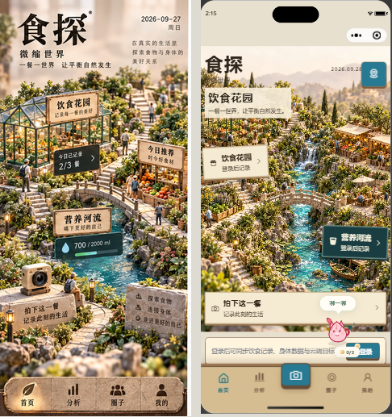
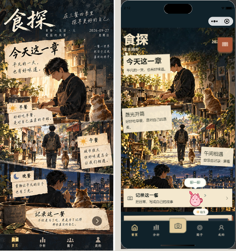

# 均衡主题 V4：场景素材与真实功能融合

> 后续场景/业务融合与跨页面主题同步修复见 [V5 记录](../balanced-themes-v5-20260928/README.md)。本文保留 V4 阶段证据与当时的限制。

本轮针对 V3 差距审计中最明显的素材、材质和假交互问题实施。不是八套主题完整视觉验收通过的声明。

## 已落地

- 微缩世界：精细花园、溪流、邻里广场和旅行书桌，饮食/饮水标牌连接原有操作。
- 绘本陪伴：高清晨光、午间、夜晚叙事长画及阅读书桌；深色底部导航和系统文字对比度同步适配。
- 水之道：水滴、黑石、餐食的真实材质；记录、饮水、分析入口独立可用。
- 自然共生：植物标本纸张；东方雅集：青瓷清汤取代不相符的西式沙拉；现代艺廊：撕纸餐食拼贴。
- 澄明秩序、清朗关怀：编辑栅格、大字号、真实数据和明确操作。
- 移除虚构健康数值、用户和社交计数，移除整屏点击只切换演示状态的交互。首页使用现有页面数据，未登录时隐藏缓存数值。
- 分析、圈子、我的缩短纯展示区域，使真实业务内容紧接主题标题；真实卡片、分类、文字同步主题样式。
- 九张新素材放入独立约 991KB 的资源分包，按需加载、失败可重试。未下载成功时仍可使用业务入口。

## 实拍对照

左侧为 V3 渲染图首页裁切，右侧为微信开发者工具实拍。参考图与模拟器可用视口、系统胶囊和登录状态不同，不能据此声称逐像素还原。

绘本截图早于最后的日期避让、系统状态栏对比度修复；该修复有单测，尚未取得更新后的可靠截图。

## 仍需完成

1. 分析图表、真实圈子列表和个人资料区尚未逐项重构成 V3 的独有表达，当前保留真实业务组件并适配主题样式。
2. 底部导航、功能箱、宠物浮层与场景仍存在视觉断层；浮层不能遮挡主要按钮，需要进一步做全尺寸截图核验。
3. 主题字体、标牌大小与参考仍有差别；Android/iOS 字体回退、长昵称和真实长列表尚未验收。
4. 完整 32 页、已登录数据以及真机滑动体验未验证通过。详见 [design-qa.md](design-qa.md)。
5. 主包约 3048KB，仍超过 2048KB 限制（修改前约 3.3MB）。本轮资源分包未新增主包图像负担，但不能因此声称已具备小程序发布条件。

素材清单见 [ASSETS_V4.md](../balanced-themes-v3-20260927/ASSETS_V4.md)。
