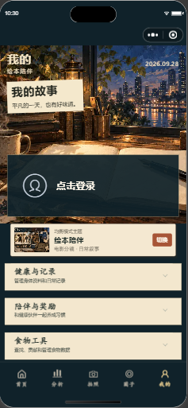

# 均衡主题 V5：真实内容、导航与主题同步

本轮继续修复 V4 场景与实际功能割裂的问题。

## 改动

- 将真实用户资料、登录入口和个人统计放入主题场景内部；切回养生模式时保留原有资料和功能。
- 圈子照片展开为完整内容宽度；头像、作者、正文、图片分别排版，继续使用真实动态。
- 八套主题的筛选栏、分析卡片、柱形图、资料分类采用各自的排版、边框与材质色。保留原始数据含义与操作。
- 东方雅集的个人页改为黑底、米金文字及双线边框；系统文字同步暗色背景。
- 拍照入口改为与其余四项导航齐平，保留识别状态、角标和点击功能；养生模式的太极拍照按钮不受影响。
- 功能箱采用当前主题的色彩，宠物活动范围固定在右侧；主要记录按钮预留宠物侧边空间。
- 修复缓存页面的主题不同步：原生复查曾出现存储为澄明秩序、圈子仍为东方雅集。主题变化事件、页面重新显示与页面容器现在共同同步保存的选择。

## 实际页面证据

下面为微信开发者工具游客状态截图，展示真实登录入口融入绘本书桌场景，以及齐平的拍照导航。

## 仍有差距

分析页尚未实现参考图中的流水景观数据节点与电影胶片图形；当前为真实分析组件的主题适配。图表和长列表的登录后表现、不同屏幕尺寸、完整 32 页逐图验收仍需完成。素材中的美术文字与系统字体也尚未完全统一。

原有主包仍超过微信默认 2MB 限制。开发截图使用临时大包配置，提交前恢复；不代表可以直接上传小程序正式版本。
