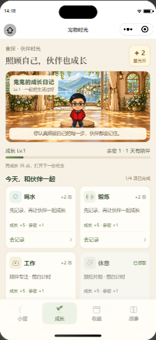
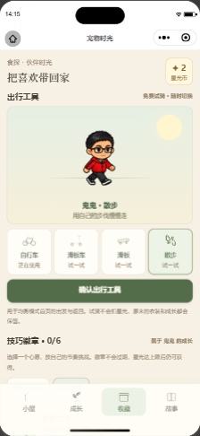

# 成长与周报流程阶段验收

按用户确认的顺序，先恢复原生导航和截图，再验收四项行动、书架，随后检查出行与照片角色。本轮没有修改业务代码；下列结论来自真实账号的运行操作，未模拟记录或修改时钟。

## 本轮通过

| 检查 | 实际结果 |
| --- | --- |
| 进入书架并取书 | 原生导航成功，点击已有书进入周报；返回书架检测到两本书，无取回错误 |
| 周报正文 | 检测到故事场景，未出现加载骨架或报告错误，取得下方真实截图 |
| 四项成长入口 | 喝水、锻炼、工作、休息入口均存在、可触摸；已完成休息入口随后正确禁用 |
| 工作计时 | 整卡标题可打开计时；开始、暂停、切到小屋、返回成长、明确继续和结束操作通过 |
| 未完成不发奖 | 工作计时结束后钱包仍 0 币、0 条回执，无残留计时 |
| 休息完成结算 | 使用真实 1 分钟前台计时，等待完成；钱包从 0 到 2 币，回执从 0 到 1，计时清除 |
| 防重复领取 | 再次触摸休息按钮，按钮禁用，余额保持 2 币、回执保持 1 条 |
| 卡片尺寸与状态 | 四卡实际宽 182px、高约 161px；最小高度 47px，禁用卡背景与文字颜色明显区别 |
| 成长导航 | 小屋、成长、收藏、故事入口触摸与返回成长通过；初轮仅预览入口未改变钱包 |

此图是当前周报阅读器的原生截图，不是书架截图，也不是设计渲染图。

后续重开项目并重新启用自动化成功，取得并逐张查看以下截图：

| 实际书架 | 完成休息后的成长页 | 出行预览与收藏 |
| --- | --- | --- |
|  |  |  |

当前角色的自行车、滑板车、滑板和散步预览切换通过，未点击确认或扣币。滑板样式显示 1.5s 播放且为 running，但三次查询得到相同 transform；此信息只能证明播放配置存在，不能作为自然连续动作已通过的证据。

## 未完成与限制

- 当前饮水、运动显示“去记录”，本轮没有代填健康记录或制造领奖依据。后续实际页面栈确认两种入口均到达对应记录页；返回后仍报告记录页，返回流程未通过。`entry-transport.json` 保留失败结果，`routes-screens.json` 中该两步的 ok 只表示调用完成，returned 值不满足返回成长页条件，不能算完整链路通过。
- 书架、成长和收藏多次截图曾返回 `fail to capture screenshot`；后续重开取得上方新截图。截图仍有间歇性失败，不能宣布工具完全稳定或全页面、全角色视觉验收完成。
- 仅重开当前食探项目，CLI open 与后续 auto 重新启用均成功；先前准备阶段阻塞已解除。未退出整个 IDE、清理登录、修改用户私有配置或重启后端。
- 当前账号真实增加的 2 星光币来自正常休息计时结算。没有清除这次合法回执或回滚钱包，避免影响已保存的账号进度。
- 出行预览后续切换通过，但未确认六角色手、车把、臀部、车座和脚踏的视觉接触。自行车仍为滑行，不是连续踩踏；滑板车仍是站姿重心变化。本轮没有将它们改成未经验证的新动作。
- 真实照片生成待用户指定已有照片路径。未使用历史截图冒充照片，未调用收费生成接口，也没有替换当前宠物。

## 专项回归

动作、工具适配、素材边距与浮窗检查：4 套、40 项 Jest 通过，耗时 106.966 秒。后端 `internal/pet/service` 测试通过，handler 包无测试文件；没有启动服务或执行部署。校验覆盖不能代替真实照片生成与动作视觉验收。

## 后续顺序

1. 继续排查记录页返回结果与间歇性截图失败，完成饮水、运动入口与返回检查。
2. 使用已有真实记录验证领奖，再验收完整工作结算、消费和跨页反馈。
3. 检查所选角色的三种出行工具，再逐个确认六个角色的接触点和运动连续性；根据实际缺陷修动作。
4. 使用用户指定照片生成完整角色，检查全身、身份及独立动作，失败保留旧档案。
5. 完成基础验收后组织小范围试玩，以实际反馈决定玩法调整。暂未开展真实用户留存或趣味性测试。

原始运行摘要：`bookshelf-navigation.json`、`initial-check.json`、`care-live.json`、`entry-transport.json`。早先截图超时记录仍保存在原周报验收目录，本轮新增成功证据不覆盖原失败历史。

后续成功运行记录为 `transport-preview.json` 与 `routes-screens.json`。本轮文档本地提交，远端推送仍遇到 GitHub 连接失败。
