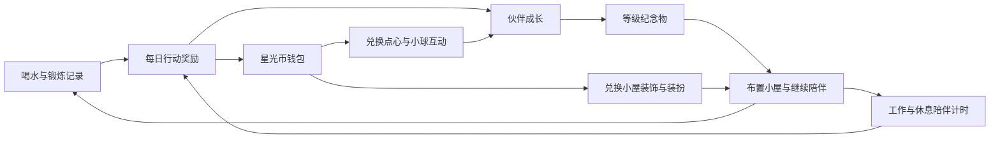
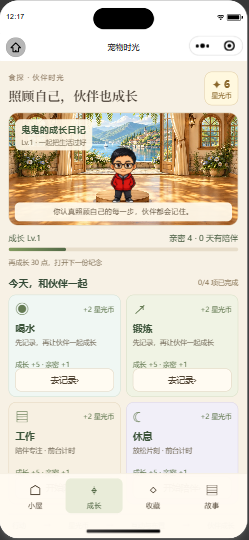
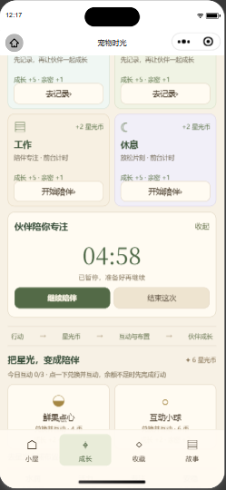
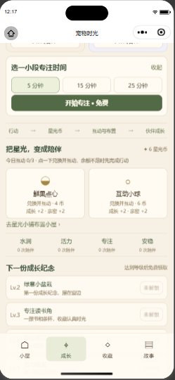

# 宠物成长与星光币循环

原“小镇”页改为“成长”，围绕喝水、锻炼、工作、休息组织。所选宠物的名字、模板或照片形象来自程序现有档案。星光币沿用原成长钱包，不建立第二份余额，不清除旧游戏、装扮或收藏记录。

## 四项行动

| 行动 | 完成依据 | 每日奖励 | 伙伴反馈 |
| --- | --- | --- | --- |
| 喝水 | 当日已保存的正数饮水量及饮水条目 | 2 星光币、5 成长、1 亲密 | 招手与水润陪伴次数 |
| 锻炼 | 当日已保存的运动记录，须有记录 ID 和日期 | 同上 | 跳跃与活力陪伴次数 |
| 工作 | 选择 5、15 或 25 分钟前台专注陪伴计时 | 同上 | 专注与完成庆祝 |
| 休息 | 选择 1、3 或 5 分钟前台放松陪伴计时 | 同上 | 放松回应与安稳陪伴次数 |

每项按账号、日期和行动去重，切换宠物不会再次领取。成长归领取时的伙伴。记录查询失败可以重试；点击领取时重新查询，缓存中曾有记录并不能直接发奖。记录页沿用已有饮水、运动功能，成长页不会自动添加健康记录。

工作与休息保持免费。一个伙伴同时保留一段计时；切换种类先结束已有计时。离开成长页、进入后台或更换身份会暂停，返回后需明确继续。跨日未完成的计时需要结束；已完成但保存失败的计时按原日期重试，不回退今天的奖励账本。存储暂时失败时，当前页面会话保留待保存进度；若所有存储写入失败后彻底关闭应用，内存进度无法承诺恢复。

## 代币如何回流为成长

| 去向 | 消耗 | 收获 | 限制 |
| --- | --- | --- | --- |
| 鲜果点心 | 4 币 | 伙伴招手回应、成长 +2、亲密 +2 | 两种道具合计每账号每日最多 3 次 |
| 互动小球 | 6 币 | 伙伴跳跃回应、成长 +2、亲密 +2 | 同上 |
| 星光小铺 | 保持原明码价格 | 小屋装饰、现有体型可用的装扮 | 已拥有物品不重复扣币 |
| 等级纪念物 | 免费 | Lv.2 绿意小盆栽、Lv.3 专注读书角、Lv.4 暖心夜灯、Lv.5 活力星星、Lv.6 旅途风景框 | 每伙伴每等级领取一次，随后可放在小屋 |

四项每日合计最多 8 币、20 成长；新一天两款有效小游戏另可各得 6 币，合计来源最多 20 币。游戏成长上限与生活行动成长分别计算。历史存档中已获得的 24 币游戏日记录保留。两款游戏仍可从成长页进入，已移除的餐车和寻宝没有恢复入口。

兑换、扣币与成长一起写入同一带 revision 的存档，成功后才展示成功反馈；同一收据重试不会重复发币或扣币。纪念品名称与实际已有图集对应，领取后通过“去摆放”进入收藏页。

## 实现边界

- 这是本机成长与星光币系统，独立于 AI 积分，不支持现金兑换，也没有新增云端钱包或跨设备经济同步。
- 饮水接口目前包含饮食自动写入的水分条目，DTO 不提供来源字段；因此完成依据是“已保存饮水量”，不能声称验证了手动喝水行为。
- 运动以保存成功的记录为准，异步分析中的任务不计入；保存的零热量记录也可符合条件。
- 工作与休息仅代表前台陪伴计时，不验证实际工作、睡眠或健康表现。
- 互动使用现有每个角色支持的动作和回退能力，本次没有重新生成专属动作或出行姿态。

## 验收

首轮完整强制门禁通过 TypeScript、ESLint、暂存 diff 与敏感文件检查，以及 122 套 / 671 项 Jest 测试。专项测试覆盖共享钱包、旧存档、重复领取、奖励独立于游戏上限、记录删除后重新确认、前台计时、后台暂停、跨日重试、身份变化与消费失败。补充修复同一伙伴更换外观后的旧计时清理，以及钱包读取失败时保留内存中的完成进度；各有交互回归。

微信开发者工具原生运行检查已通过四项入口、地图替换、两个退役游戏入口缺席、工作开始/暂停/切页重开/明确继续/结束。结束未完成计时前后，实际钱包余额和奖励收据数量均未变化。没有在真实账号中代填健康记录或兑换互动道具；饮水和运动奖励、完整计时领奖与消费的失败/重试由交互测试覆盖。开发工具检查不代表全部真机或后台健康 API 流程验收。

原生检查记录：[native-check.json](native-check.json)。以下为程序实际截图，不是设计渲染图：

| 成长与四项行动 | 计时暂停与继续 | 星光币互动与纪念物 |
| --- | --- | --- |
|  |  |  |
