# 食探伙伴成长、收藏与游戏空间完整设计报告

**日期：2026年10月2日｜版本：候选设计1.0｜范围：产品、玩法、内容、视觉与工程实施**

本报告以用户已选择的“宠物成长与收集”为主线，让当前认可的伙伴通过游戏获得经历，再把经历变成装扮、小屋、动作与故事。四款游戏服务长期陪伴，单人用户、不参加排行或没有好友的用户都能完成主线。

本轮只交付报告与设计图，不改业务代码或线上资产。“现状”来自源码和实现证据；“候选设计”尚待建设；新增时长、分值、价格与阈值均待试玩。候选图使用现有原角色素材，表达布局与信息层级，不能当作微信实拍或上线证明。QQ公开资料提供机制启发，未披露的内部技术和经济规则不作推断。

阅读目录：

1. 产品定位与共同陪伴循环
2. QQ机制启发与证据边界
3. 当前实现与目标体验对比
4. 入口、导航与视觉设计
5. 成长、职业与章节故事
6. 收藏、衣橱与小屋
7. 四款游戏完整候选设计
8. 星光经济与首30天节奏
9. 社交、真人PK与异常恢复
10. 动作资源与工程实施
11. 实施优先级与交付门槛
12. 度量与30项贯通验收
13. 附录：来源与规格索引

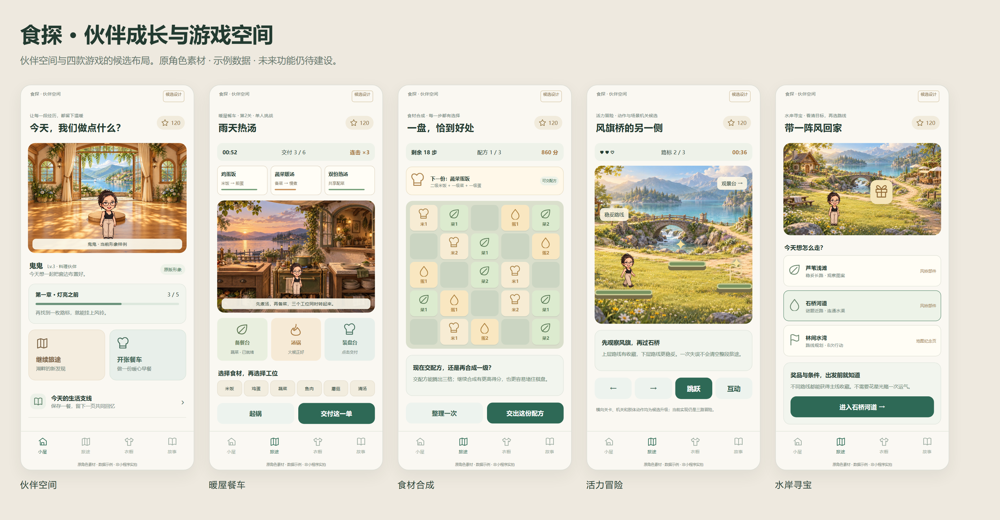

*图01｜伙伴空间与四款游戏的设计总览。候选设计示意，沿用现有原角色素材；非原生实拍。*

## 1. 产品定位与共同陪伴循环

体验围绕“认出我的伙伴→知道今天能做什么→看见刚得到的成果”。默认先展示伙伴、小屋与当前章节，不让排行或复杂商店占据首屏。风铃可以挂到门边，来信可以读完收入旅途册，递餐动作可以在小屋再次播放；每次结算同时支持继续与自然结束。

四游戏分别提供排程经营、步数规划、动作解谜和路线探索，共用身份、背包与结算，各自保留不同节奏与复玩目标。竞技分独立于健康评分，真实生活记录用于可选支线，不增加角色强度。

现有八套均衡主题继续保留，养生模式不变。伙伴空间可有主题外壳；首页、分析、圈子、我的、工具与原聊天继续承担各自业务，健康数据不能由游戏成果填充。

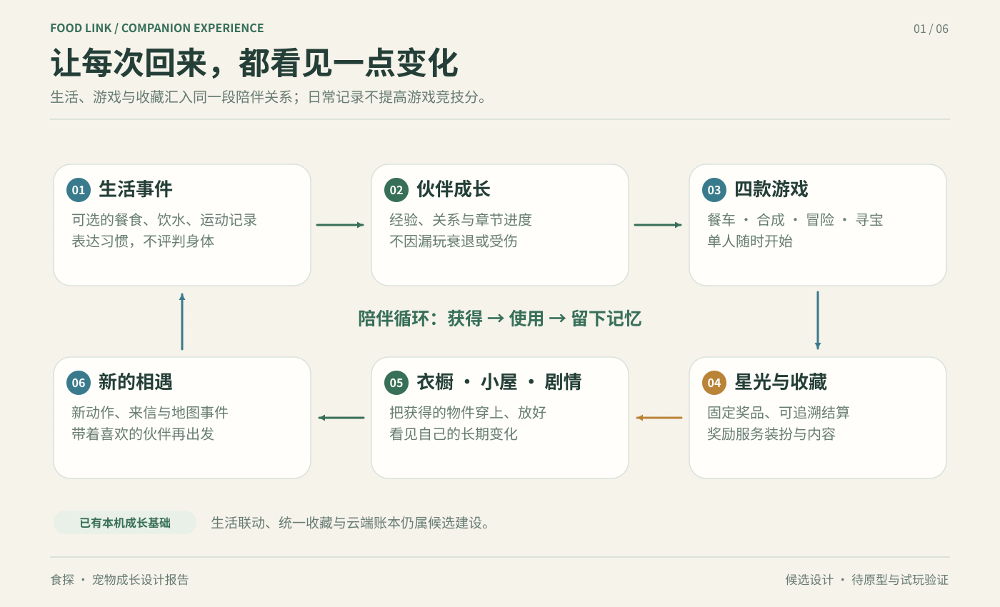

*图02｜生活、成长、游戏与收藏形成长期陪伴循环。候选机制示意，非原生实拍；云端奖励和生活联动仍待建设。*

## 2. QQ机制启发与证据边界

依据已完成的[QQ公开资料调查](../../research/qq-pet-mechanics-and-technology-20261002.md)，新版于2026年7月27日回归，9月9日新增成长福袋，9月28日宣布鸿蒙上线。调查没有登录QQ逐项实测；具体事实分别见[回归公告](https://weibo.com/2/detail/5325249576960481)、[福袋公告](https://weibo.com/2/detail/5341176760902049)、[鸿蒙公告](https://www.sina.cn/news/detail/5348077072287370.html)。

| 可借鉴的机制 | 食探的转译 | 证据边界 |
| --- | --- | --- |
| 照料、学习与职业连接展示 | 职业带来动作、餐具、纪念页和小屋变化 | 部分职业细节来自媒体，不当作内部规则 |
| 成长成果成为来访理由 | 主动发布小屋快照、收藏与旅途册 | 不复制未公开的金币概率与公式 |
| 性格与回应形成陪伴感 | 预写故事、AI短回应与白名单动作 | AI不决定奖励、胜负、价格或健康分 |
| 持续内容提供不同目标 | 章节、分支和固定收藏路线 | 不用饥饿、死亡或失去物品制造压力 |

[秋秋人](https://www.sina.cn/news/detail/5346310527648139.html)是好友聊天共同养成的独立对象，不改变食探单宠主线。[信息时报报道](https://xxsb.gz-cmc.com/pages/2026/07/27/d914754bd0c24f88b0d92604426ef45f.html)提及PK，但其协议、实时操作与裁定规则尚不足以确定。本文同种子PK属于食探候选方案。

QQ9的Filament、历史QQ空间萌宠的Spine与超级QQ秀的虚幻引擎分别属于不同对象，不能证明2026新版宠物的引擎。食探只借鉴动作制作、资源版本和规范化管线，具体选型须在微信环境验证。[QQ9研发文章](https://developer.cloud.tencent.com/article/2396572)、[腾讯ISUX动作制作文章](https://developer.cloud.tencent.com/article/1154194)、[腾讯业绩公告](https://static.www.tencent.com/uploads/2022/03/23/bdee4ce27bd7ca8e23656c8ebff0b55e.pdf)。

## 3. 当前实现与目标体验对比

当前已有本机单人餐车与伙伴冒险基础。它们能提供具体操作、成绩、部分收藏和保存流程，但尚未覆盖本报告的全部玩法、完整肢体动作、统一跨页穿搭、云存档、正式星光账本或真人PK。前版104套399项门禁与部分原生操作通过，不等同于新版设计已验收；当前截图超时仍阻塞正式视觉确认。

| 领域 | 当前已有基础 | 本报告候选目标 |
| --- | --- | --- |
| 伙伴身份 | 用户认可原形象可保留，模板及照片使用各自档案 | 名字、形象版本、动作与穿搭由统一身份快照贯通所有界面 |
| 餐车 | 六个90秒关卡、十二配方、三工位、火候与订单 | 丰富排程取舍、餐车故事、菜谱收藏与完整厨师动作 |
| 冒险 | 三章六关、三跑道、换道、跳跃、冲刺、暂停 | 新场景与分支机关，收藏支路、短场景动作解谜 |
| 合成／水岸 | 尚无本报告所列完整玩法 | 各自独立规则、六关样本、教程、终局与收藏用途 |
| 成长 | 本机冒险经验、三段固定故事 | 成长、亲密、职业与真实生活事件明确区分后连接 |
| 收藏与小屋 | 四件兑换收藏、装备、三个摆件槽 | 统一收藏册、兼容衣橱、来源透明的制作与回忆页 |
| 星光 | 按账号与宠物隔离的本机资源，普通日上限60 | 按账号管理的服务端账本；48／68上限是独立候选规则 |
| 竞技与云端 | 无真人匹配、云同步或服务器复算 | 可选同种子PK、断线恢复、输入核验与事务奖励 |
| 动画与画面 | Taro View/Image与静态角色整体位移基础 | 按角色适配的肢体动作；Canvas候选原型与真实设备证据 |

现有三章名称为“晨光林道”“石桥溪谷”“云顶山径”，每章两关；当前时长分别45、50、60秒。它们与第5章拟定的“灯亮之前／水岸失物／雨天的餐车”属于不同层次：前者是已实现冒险分章，后者是新的跨游戏故事章节提案，不能在更新时无说明覆盖用户已通关进度。

| 现有冒险章节 | 两个现有关卡 | 当前单局时长 |
| --- | --- | --- |
| 晨光林道 | 晨光初行、林间回声 | 45秒 |
| 石桥溪谷 | 溪谷石桥、水岸追光 | 50秒 |
| 云顶山径 | 山径远望、云端归途 | 60秒 |

现有收藏为窗边小绿植20、暖光小台灯30、叶纹滑板40、探险小围巾30星光，冒险经验每局最多80。上述是当前版本配置；后文候选经验曲线、商品80—300和普通日48／周奖日68均须单独上线及迁移，不自动替换现有规则。现有“清除缓存”可清掉本机进度，云端建设前必须明确展示这一保存范围。

当前暂停／切后台恢复指同一仍存活页面内的局面冻结与继续，不等于进程关闭、重登后恢复未完局；餐车当前未完局不跨进程保存。持久局内恢复点与PK断线恢复均为候选能力。现有冒险主要是静态角色随滑板整体移动、起跳，部分角色有有限精灵帧，不能据此称所有模板或照片已具备完整肢体动作。

*图03｜章节地图：主线、已得收藏与可重访支路。候选设计示意，沿用现有原角色素材；非原生实拍。*

## 4. 入口、导航与视觉设计

聊天内的当前宠物卡是主要入口，展示名字、已确认形象和“去伙伴空间”行动；点击进入独立空间，不覆盖聊天对话，也不修改用户当前主题。伙伴空间首屏只组织三件事：看见伙伴、继续当前章节、使用刚获得的收藏。小屋、地图、衣橱、故事、活动和可选PK成为空间内的明确栏目。

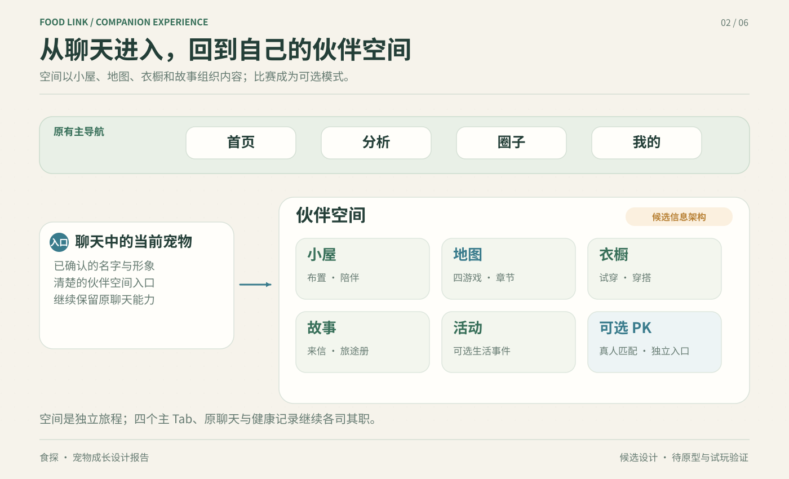

*图04｜保留四主Tab，从聊天宠物卡进入独立伙伴空间。候选信息架构，非原生实拍；现有首页、分析、圈子、我的及原聊天能力保持。*

*图05｜伙伴空间首屏：当前伙伴、温暖小屋与章节目标。候选设计示意，沿用现有原角色素材；非原生实拍。*

视觉采用米白、木色、松绿、湖蓝与琥珀暖光；温馨也来自回应、收藏落地和失败后能继续。场景留出首屏操作，主按钮、时间、目标和错误状态保持清楚。八套均衡主题可改变材质、边框与场景光色；规则、奖励、身份和操作结构一致，水之道延续湖蓝玻璃外壳，养生模式不受影响。

布局按320、375、430逻辑像素验收。两列商品卡完整显示图片、名称、价格、兼容状态和按钮；顶部避开微信胶囊，底部留出安全区。火候、危险和已拥有用形状与文字辅助颜色判断。故事、动作、换装和结算可返回或跳过；音乐、音效、震动及背景动效分别可关闭。低性能设置减少装饰，保留判定反馈。加载用骨架或动画，未完成游戏显示建设状态，不以封面代替玩法。

## 5. 成长、职业与章节故事

本节以“宠物成长与收集”为主线，采用温馨的小屋与故事承接短时挑战。以下标注“现状”的内容来自现有源码和交付文档；未标注为现状的系统、数值和发行安排均为候选设计，需试玩后定版。鬼鬼只作为报告画面样例，系统支持用户已选模板和照片宠物，名字、原形象与装备持续绑定同一宠物身份。

### 5.1 成长不是一条刷分进度条

长期目标分为成长、亲密、收藏三个互相连接的层次：成长回答“我们学会了什么”，亲密回答“我们经历了什么”，收藏回答“这些经历留下了什么”。游戏成绩单独保存，三者都不提高竞技数值。成长经验不可消费，职业任务是完成清单，亲密度不兑换商品；可消费的宠物货币统一命名为“星光”。

现状：本机冒险已有经验、三章六关、四件收藏、装备、三个摆件槽和三段固定故事；每局经验最多80，星光普通日上限60。后端另有生活习惯经验，尚未与冒险统一。长期成长方案应先定义事件，再连接旧系统，不能直接把两个经验值相加。

候选成长前六级累计经验为0、40、100、180、300、460。教学完成20，章节首次目标30；每日首场有效游戏10、首项有效生活记录10，常规经验每天最多20，教学与章节奖励各领一次。等级用于逐步介绍内容：Lv1看见伙伴与基础小屋；Lv2打开成长册；Lv3选择第一项职业；Lv4开启更多小屋布置内容；Lv5阅读分支故事；Lv6展示阶段纪念。用户初次进入即有完整免费外观、待机和基础互动；Lv1即可摆放首章免费旅途卡，基础小屋互动不等待Lv4。扩展家具内容再随成长介绍。

亲密度按有意义的互动积累，建议首次互动每日2点、首次有效游戏4点、首次有效记录4点，每天最多10点。20/60/120/200点分别解锁招呼、共同回忆、信任对话和伙伴纪念；这些是内容门槛而非对用户感情的评价。连续触摸不反复加点，离开不扣点、不生病、不丢收藏；回来时显示欢迎动作和一个能完成的小目标。亲密满级后继续保存新的回忆，不反复弹满级提示。

三条成长轨道在成长册中同时可见：经验→等级→职业，共同事件→亲密→回应与回忆，星光／章节目标→收藏→穿搭与小屋。三条轨道汇入下一段故事，避免把伙伴成长简化成单一刷分条。

### 5.2 职业树：有选择，也能换方向

职业表达兴趣与可见成果。职业可以并行推进，切换无需支付星光，休息几天不失去资格。料理、探索和运动三条路径均支持单人完成；职业等级不影响匹配或碰撞范围。每阶由三项清楚的任务组成，其中至少一项属于游玩技巧、一项属于收藏或故事。

| 路径 | 入门任务与初阶成果 | 进阶任务与成果 | 长期方向 |
| --- | --- | --- | --- |
| 料理伙伴 | 完成餐车教学、交3种游戏菜谱、选择一份餐车故事回应；得到递餐展示动作 | 在两种订单配置中达成清晰目标、收齐固定餐具；得到厨房角和配方册封面 | 早餐摊、露营餐车、雨天饮品店；新增主题配方与动作 |
| 水岸探险家 | 完成探路教学、选择一次安全路线、找到指定路标；得到观察动作 | 完成水渠与石板两类谜题、收齐地图纪念页；得到探险包与地图墙 | 湖畔、旧车站、林间小径；按地图更新节点与纪念品 |
| 活力伙伴 | 完成换道/跳跃教学、通过恢复站、读完休息故事；得到伸展动作 | 在同一路线改善一次个人成绩、完成两种机关或节拍片段；得到运动主题旗帜 | 训练日、恢复日、周末散步；学习不同节奏而非反复加速 |

真实餐食、训练或恢复记录可打开职业的生活支线，但不是进入职业的唯一条件。未使用记录功能的人，通过对应单人章节仍能得到完整主线故事；记录支线提供新的对白和纪念页，不提供更强PK角色。职业“打工”若后续引入，应是可参与的小任务与固定成果，先不做离线挂时自动产币，以免星光来源失控。

以下故事章节均为新增候选，不替换第3章列出的现有冒险章名。上线时需建立现有关卡与新故事任务的关联表，并保留旧通关权益。

### 5.3 章节任务与故事例

故事使用“情境→选择→短挑战→可见变化→回忆页”的结构。选择改变对白、摆件外观或任务顺序；不会因选错而永久失去物品。每章主线能单人完成，隐藏页写明解锁条件，避免靠随机概率反复刷。章节点任务、分支与奖励由规则配置决定，AI可补写符合语气的短回应，不能自行授予经验、星光或道具。

| 章节 | 具体任务 | 玩家选择 | 结果与回访理由 |
| --- | --- | --- | --- |
| 第一章：灯亮之前 | 找到3枚路标；餐车完成一份游戏餐；回小屋放置免费旅途卡 | 先布置窗边，或先摆餐桌 | 伙伴做欢迎动作；小屋出现暖光；成长册留下“第一次一起出发” |
| 第二章：水岸失物 | 查看可见路线奖品；完成水渠节点；把指定纪念物带回 | 走稳妥长路，或尝试谜题近路 | 同一收藏可从两条路线获得；对白和地图印记不同，提供可复盘挑战 |
| 第三章：雨天的餐车 | 完成固定雨天订单；选择帮忙备餐或整理收摊；为小屋选一件餐具 | 延续热闹晚餐，或安排安静休息 | 解锁递餐/坐下读书展示；雨声成为可关闭的房间氛围 |

生活支线例：保存一条餐食记录后，伙伴邀请“把今天的一餐写进旅途册吗”；用户确认后关联记录ID，可选择只留一句话而不展示原图。训练或恢复记录都能触发“今天的节奏”支线，分别呈现练习与休息对白，奖励等价。饮水任务可推进水岸花园，未使用该功能时允许用一条其他支持的生活记录替代。故事先显示授权范围，用户删掉原记录后移除关联内容；已获得的普通纪念品保留，不能因为整理记录丢失收藏。

*图06｜故事页：由已发生事件触发的来信与选择。候选设计示意，沿用现有原角色素材；非原生实拍。*

### 5.4 动作解锁与内容生产

待机、眨眼、开心、挥手、庆祝及失落后恢复六项为基础动作。职业赠送递餐、观察和伸展的独立展示版本，故事赠送坐下读书等展示；商店150星光的动作应是额外展示动作。备餐、递餐、观察、收线及跑跳蹲、受击、落地等玩法必需动作随对应游戏免费提供，不以职业解锁或购买为前提。动作商品只有在该宠物已适配时可兑换。

每次解锁同时写入“动作ID、版本、来源事件、适配形象版本”，在动作册预览并可加入快捷栏。新素材必须保持原脸、发型和比例，并让服饰跟随动作锚点。照片宠物缺少某动作时继续使用已认可外观，显示该动作待适配；不能换成鬼鬼，也不能把整体拉伸当成跑步。动作包验收覆盖原始鬼鬼、至少两类模板及照片宠物样本，逐项检查脸部遮挡、服饰穿模、脚下落点与返回待机。

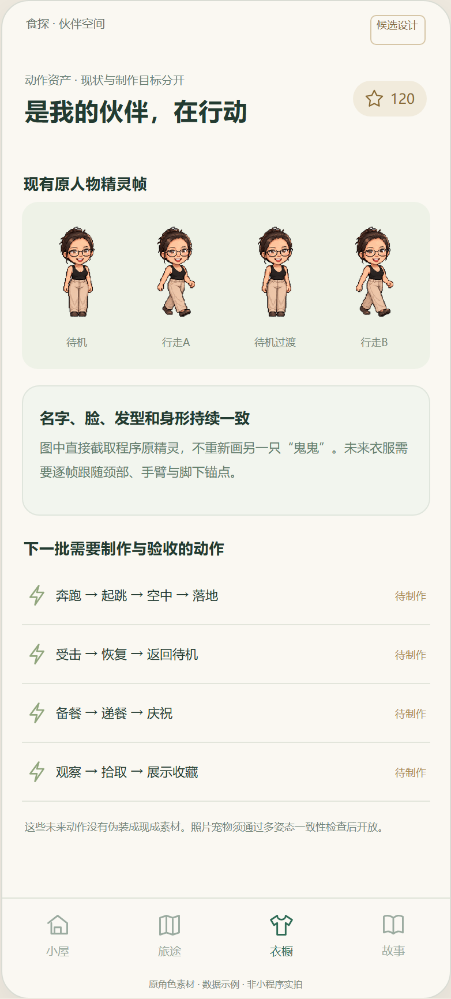

*图07｜动作册：已支持动作、解锁来源与适配状态。候选设计示意，沿用现有原角色素材；非原生实拍。*

## 6. 收藏、衣橱与小屋

收藏册分为服饰、动作、房间物件、旅途纪念页。每张卡写明来源、条件、价格、适配情况与已拥有状态。普通商品固定兑换；章节奖励固定目标；制作物展示固定配方和材料去向。首版不加入额外通用材料货币，也不做付星光抽奖。QQ公开的随机金币福袋提供了“成长成果成为来访理由”的参考，食探采用确定奖励与收藏路线。

衣橱先全身试穿再确认，预览不扣币。已拥有物品不能重复购买；不兼容物品可查看但不能付款。切换宠物不清空背包；账号拥有物品权益，各宠物保留自己的穿戴与摆放档案，支持兼容的物品可用于其他宠物。成长章节仍跟随宠物，发币上限按账号计算，避免通过切换伙伴重复领取。

小屋首期沿用三个明确摆件位置，窗边、桌面与地面都有单独兼容范围；家具不挡住宠物及主要按钮。下一期再评估自由摆放，提供拖动范围、吸附、撤销与恢复默认布局。用户能保存一套日常穿搭和一套章节穿搭，首页、聊天、成长页从同一外观档案读取，不能衣橱换了而首页仍是旧服饰。来访者看到的是主人主动发布的快照，编辑时不把未保存布置实时公开。

*图08｜衣橱：全身试穿、商品来源与兼容状态。候选设计示意，沿用现有原角色素材；非原生实拍。*

## 7. 四款游戏完整候选设计

以下为下一阶段候选设计，所有关卡数量、时长、分值、容差与验收目标均待试玩确认。当前餐车与三章六关冒险已有本机单人基础；本节新增机关、动作、收藏内容与真人匹配不代表已经实现。四款共同产出星光、成长经验与可收藏物，但游戏基础分独立于健康评分，记录餐食、运动或饮水不加竞技分。星光发放频次与上限由报告统一经济规则确定，本节不另设每日上限。

每款游戏都可独立单人游玩。宠物沿用用户已确认的当前模板或照片形象、名字与穿搭，不固定为鬼鬼；角色更换不清空账号收藏。奖励用于动作、装扮、小屋与故事，不改变关卡操作能力。离开、失败和漏玩不会让宠物饥饿、死亡、失去装扮或欠下债务。

| 游戏 | 操作与思考的重心 | 候选单人节奏 | 主要成果 |
| --- | --- | --- | --- |
| 暖屋餐车 | 并行工位、火候与订单排程 | 90秒标准局 | 菜谱、餐具、餐车故事 |
| 食材合成 | 有限步数、空间与配方取舍 | 无倒计时，约2—4分钟 | 陶盘、食材印章、展示架 |
| 活力冒险 | 分支路线、时机与场景机关 | 约90秒，新升级待原型 | 动作、风铃、旅途与小屋材料 |
| 水岸寻宝 | 行动预算、观察解谜与打捞 | 无单人计时，约2—4分钟 | 地图纪念物、来信与回忆页 |

以下24个关卡均是候选内容样本，不是当前可用关卡目录。每款“九十秒实际操作例”描述具体输入、判断和结果；合成与寻宝的单人局不因此被强制限定为九十秒。

### 7.1 暖屋餐车：让忙碌变成有章法的照顾

**为什么好玩。** 玩家经营小屋门前的餐车，乐趣来自“我终于排顺了”的能力感。三个工位能够并行：把汤放上炉后先处理切菜，等待米饭时装盘。顾客有清楚的喜好与小故事，完成一单会留下桌面变化。热闹感来自自己安排流程，不靠无休止点按。

**核心决策与操作。** 上方最多显示三张订单，中部为备餐、加热、装盘三个工位，教学关合并备餐与装盘为两区；加热工位同时只处理一锅。下方是本关六种以内食材。点击食材后点工位即可操作，拖拽是可选捷径。工序图标固定顺序；生熟食材不可混用。加热时点“起锅”，安全区同时用括号、纹理与文字提示。玩家重点决定先处理哪单、何时启动长工序、是否为下一单预备一份通用食材。备餐区最多留两份半成品，不能无限囤货。已有食材不足时可切换另一订单，不陷入等待死循环。

订单耐心耗尽后顾客挥手离开，稍后仍能回来；错单退到装盘台供拆解，不扣星光。烧焦只清空该锅并中断连击；清锅约两秒后恢复，不让一次失误影响整局。暂停冻结单人订单和火候。结算给出一条可操作复盘，如“灶台空了十二秒，可以先煮汤”。标准局九十秒，达到正确交付目标即获得基础通关，追求品质与连击是进阶挑战。

**计分与收藏。** 候选计分为订单基础分乘品质、连击系数；简单、中等、复杂订单分别为一百、一百五十、二百分，品质最高一点二倍，连击最高一点三倍。失败订单不计分，连击中断；清理动作不额外扣总分。首通按固定清单获得围裙纹样、餐车贴纸、菜谱页或小屋餐桌材料，重复挑战推进菜谱熟练度并按统一规则获得星光。菜谱册明确写“游戏食谱”，不会生成用户吃过这餐的健康记录。

| 候选关卡 | 本关新增约束 | 真正要学的决策 | 固定收藏／故事 |
| --- | --- | --- | --- |
| 1 迎客早餐 | 两工位、鸡蛋饭与暖汤、四单 | 开始长工序后去做短工序 | 早餐菜谱页、邻居首次来访 |
| 2 雨天热汤 | 三工位、热菜出锅后保温窗口 | 先装易冷菜，汤最后端出 | 雨滴杯垫、门口雨棚故事 |
| 3 双份野餐 | 两位顾客要共享配菜、六单 | 一次备两份，留出半成品空间 | 野餐布纹样、邀宠物去草地 |
| 4 午后烘焙 | 烤箱占位较久、短订单穿插 | 烤箱不停转，避免全台等待 | 小烤箱摆件、第一块饼干 |
| 5 灯下晚餐 | 两种组合餐、顾客到达顺序变化 | 选稳妥连击或复杂高分单 | 桌灯材料、共同晚餐章节 |
| 6 小屋宴会 | 自选三道已学菜、波次高峰 | 开局选菜单，途中调整顺序 | 餐车招牌、宴会纪念照片 |

**九十秒实际操作例。** 雨天关开局同时有鸡蛋饭和蔬菜汤：零至十秒选择鸡蛋饭食材并完成备餐；十至二十秒送灶台加热，趁火候推进在备餐台处理蔬菜汤。二十至三十五秒饭出锅送装盘，空出的灶台开始煮汤，再把饭递给顾客。三十五至五十秒先交快失去耐心的旧汤单，同时为新到的双份汤预备配菜。五十至六十五秒下一锅火候失误，点清锅，借两秒清锅时间整理剩余配菜。六十五至八十五秒减少预备库存，依次完成手中订单；最后五秒收台。每一时刻只有一锅在加热，但备餐与装盘可并行。玩家复盘哪次排序造成空转，再决定重试或把杯垫放到小屋。

**宠物动作与内容持续性。** 拿菜时上臂抬起、手腕转向篮子；切菜时前臂小幅往复，另一只手扶菜；翻锅时肘部带动锅柄；递餐时身体向顾客微倾，双手推出托盘；失误后垂肩、看一眼锅，再吸气抬头继续。角色原有的头发、耳部、尾部与服饰按自身结构联动，不新增原形象没有的部件，不把整张图片缩放当肢体表演。季节内容通过新工序组合、工位位置和顾客故事增加差异，同一配方可进入野餐、烘焙和宴会，不只抬高分数目标。

**可选PK、无障碍与验收。** 真人PK候选采用同订单种子、同工位与九十秒时长，两人独立经营；比总分，再比正确订单数、烧焦次数，仍相同则平局。无抢单、道具购买或健康加分。单手点击、火候自动停锅辅助与无计时练习供选择；辅助规则分别标识并在相同规则组匹配。首轮十二名新手试玩目标：至少十人能独立交第一单，至少九人能说出一次排序选择；第四关工位空转时间比第二关下降百分之十五，且至少八人自愿重玩。任何数值只是候选目标。

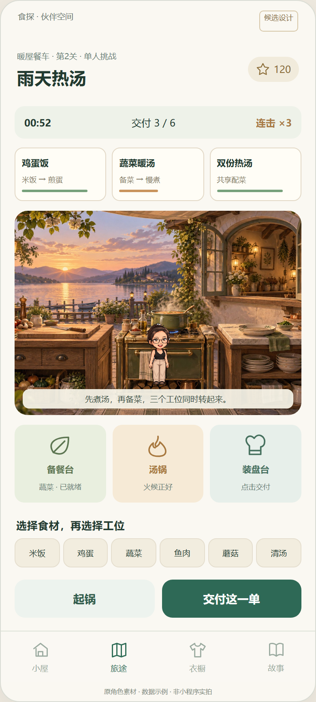

*图09｜暖屋餐车：订单、并行工位与火候操作。候选设计示意，沿用现有原角色素材；非原生实拍。*

### 7.2 食材合成：把有限空间变成一桌小成果

**为什么好玩。** 棋盘每一步都留下结果，连续合成带来清脆反馈；配方允许把棋子变成收藏餐盘，也给堵塞的棋盘留出出口。好玩之处是“现在交菜腾空间，还是保留它冲更高等级”，玩家可以思考，适合不想连续高速操作的人。

**核心决策与操作。** 候选为五乘五棋盘，四方向滑动；同类同级棋子合并，每个棋子一回合最多合并一次。无变化的滑动不耗步、不生成新棋子。有效滑动后按种子顺序生成一个新棋子；界面显示接下来两枚的类别与等级，减少不可解释的随机失败。类别为主食、蔬果、蛋白三类，等级一至四；四级为顶阶，两枚四级不能再合成。等级只表示游戏收集阶，不暗示现实营养优劣。配方需准确类别与等级，点配方后高亮可用棋子，玩家逐一选择、确认提交；提交占一步，不新增棋子。

玩家决定保持哪个角落为高阶区、先清掉哪类小棋子、把有限步数用来合成还是交配方。目标与棋盘同时可见，临近满盘时提示“尚可交这道菜”，不替玩家自动操作。单人达成关卡目标即可通关；未达成目标时，步数用尽，或无空格、无可合并相邻棋子且无可提交配方，才结束为失败局。普通单人局一次撤回同步回退棋盘、步数、生成游标与本步得分，不刷出新随机结果；撤回额度仍被消耗，不能靠反复撤回保留得分。可看局末回放或重开原种子练习，不售卖复活。单人不倒计时，关卡约二十八至三十六步、两至四分钟。

**计分与收藏。** 每次合成获得新等级乘二十分；配方获得一百五十分加所用等级总和乘二十分。交配方不会重复结算之前的合成事件。过关目标独立于高分，玩家可以完成指定餐盘后离开。首通赠送固定陶盘、食材印章、收纳篮材料；收集不同餐盘解锁小屋展示架及“第一次摆桌”故事。重复物品转为明确的制作材料，不采用抽奖。星光结算沿用共同经济规则。

| 候选关卡 | 棋盘／目标变化 | 关键取舍 | 固定收藏 |
| --- | --- | --- | --- |
| 1 早餐三色 | 无障碍、二十八步、交两份一级配方 | 合成前先认类别与提交出口 | 三色陶盘 |
| 2 清爽午餐 | 三类食材、二级主食目标 | 交低阶餐盘还是继续升级 | 叶纹碗 |
| 3 篮中整理 | 两个固定占位篮、先后两张配方 | 避免高阶棋子堵住生成区 | 收纳篮材料 |
| 4 露营便当 | 一张配方分两阶段提交 | 先做当前需求，留下一步材料 | 便当餐垫 |
| 5 共享餐桌 | 同时三张配方，合用一种稀缺类别 | 把稀缺棋子给哪道配方 | 木托盘材料 |
| 6 季节拼盘 | 中央固定障碍、四阶目标与三份餐盘 | 选择高阶路线或稳定交菜路线 | 季节展示架铭牌 |

**九十秒实际操作例。** 第三关初盘已有两枚一级主食和一枚一级蔬菜：零至十五秒观察两枚预告，把主食滑到左下角合并成二级；十五至三十秒把蔬菜沿右边聚拢，避开中间篮子。三十至四十五秒玩家能交一份配方，但发现下一枚是蛋白，选择先保留二级主食。四十五至六十秒生成后多占了一格，玩家确认提交主食、蔬菜、蛋白，腾出三格。六十至七十五秒连续两次合成，宠物把餐盘摆上架；七十五至九十秒误向右滑，使用一次撤回，换成向下，完成第一张目标。局仍可继续，九十秒并非强制结算。

**宠物动作与持续内容。** 合成时宠物转头跟随落点，手指轻敲桌沿；连续合成时两手先靠拢再打开；提交时弯肘托盘、迈半步、放到桌上；思考提示是手托下巴后指向一格。棋盘与宠物舞台不重叠，动作可跳过。后续新内容增加障碍布局、配方次序、可见生成序列与限定步数谜题，编辑器必须检验目标可达；不无限追加食材类别导致辨识困难。

**可选PK、无障碍与验收。** PK候选使用同起始盘、生成种子与配方，限一百二十秒、最多三十个有效游戏步，两人各有一次同规则撤回。撤回不消耗游戏步，但消耗唯一额度且不退比赛时间。比总分、配方数，再比有效步数，仍相同则平局。四方向大按钮代替滑动，食材兼用图案和文字；不要求凭颜色识别。首轮十二人目标：至少十人能解释提交为何能救棋盘，至少九人正确预判一次滑动结果；五十个可复现局无死锁误判、撤回不改变生成序列；测试者至少八人愿意挑战同种子第二遍。

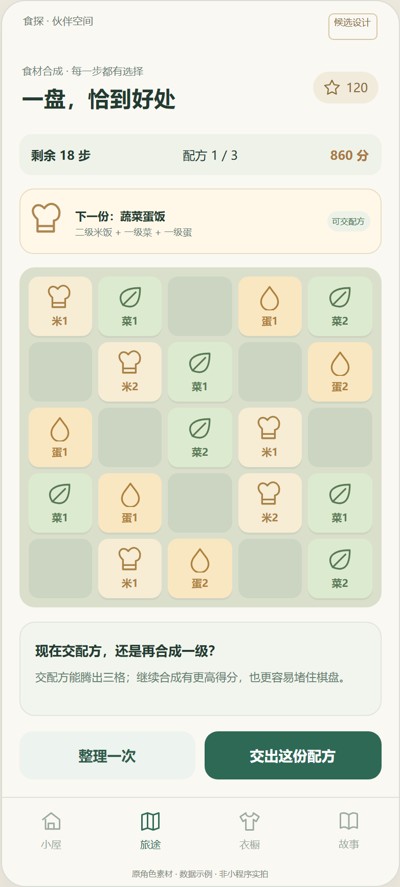

*图10｜食材合成：棋盘、配方与下一枚预告。候选设计示意，沿用现有原角色素材；非原生实拍。*

### 7.3 活力冒险：宠物带着目标走过小世界

**为什么好玩。** 冒险以“到下一处看看”为动力，动作挑战服务于寻找小屋材料和旅途故事。候选升级将现有换道、跳跃、冲刺基础发展为横向短场景：同一关有稳妥路径、收藏支路和一个需要观察的机关。玩家可以通过判断节奏与路径获得成长，不依赖提高宠物数值碾过关卡。

**核心决策与操作。** 每关三个短场景，以分支路口连接。普通段宠物缓慢自动前进；“跳跃”与“短冲刺”两个按钮清楚可见，到路口自动停下，点路径选择。机关段停下自动移动，提供前后按钮；玩家可推轻箱垫脚、等待风停再过桥、先打开木门再折返取收藏。冲刺有固定冷却，能越过短障碍但不能穿过岩石。不同场景只引入一个新规则，关卡预览先展示机关而非全部答案。此升级需要单独原型验证，不是当前三路冒险已拥有的能力。

摔落、碰撞或错过跳点后回到最近路标，候选损失两秒与当前连击，不扣既有收藏或星光，也不显示生命枯竭。路标之间最多约十五秒，重复失误三次后可选择慢速提示继续故事；提示通关保留首通内容，单独记录挑战成绩。正常单人局约九十秒，终点为基础目标，支路收藏可以后重访；暂停冻结世界。休息站是剧情和伸展展示，不能声称操作按钮完成了真实运动。

**计分与收藏。** 完成一个场景一百分，普通收集物十分，机关首次正确解法五十分；精确跳跃最高三十分，连击最高加成百分之三十。回到路标扣五十分，分数最低为零，重复经过的物件不重复计分。地图先明示支路奖品：树叶徽章用于背包装饰，木片用于小屋书架，旅行页解锁故事。服饰和成长等级不改变跳跃距离、速度或冲刺冷却；健康记录仅开启可选故事主题。

| 候选关卡 | 主舞台与新机制 | 路线选择 | 固定收藏／故事 |
| --- | --- | --- | --- |
| 1 门前小径 | 跳过矮树根，路标恢复 | 宽桥或短跳台 | 第一枚叶章、出门故事 |
| 2 晨光草坡 | 冲刺冷却、两段坡道 | 平路低风险或上坡取木片 | 小书架木片 |
| 3 风铃木桥 | 风停窗口、等待平台 | 等风稳过或绕下层 | 风铃、学会慢下来 |
| 4 林间邮站 | 推一个轻箱、开门折返 | 直达终点或回取邮袋 | 邮差帽纹样、来信故事 |
| 5 星灯石阶 | 移动踏板、明确落点预告 | 三次大跳或五次短跳 | 小屋星灯材料 |
| 6 归家夜路 | 组合已学机关、携一件纪念品 | 选一条喜欢的完整归家路 | 旅途相框、归家章节 |

**九十秒实际操作例。** 风铃桥关零至十五秒前进跳过树根，在路口看见“上层风铃／下层木片”并选上层。十五至三十秒到桥头，看到风旗横摆，松开操作等待；旗子垂下后点跳跃，落到中间平台。三十至四十五秒过早冲刺，回到桥头路标，风旗旁出现简短时机提示。四十五至六十秒按同一规律再过桥、拿到风铃。六十至七十五秒选择终点近路，不再追远处普通收集物；七十五至九十秒到休息站，宠物拉伸并展示风铃，结算后可以直接挂到小屋门边。复玩时可改走下层取另一件材料。

**宠物动作与持续内容。** 跑步要有左右腿交替与对应摆臂；跳跃先屈膝、蹬地、收腿、伸腿落地；冲刺前身体前倾、落地恢复直立；推箱时双手抵住箱侧、脚步慢移；休息时手扶膝、抬头、伸展。照片角色需要动作适配后才能使用该段；未适配时保留身份，在单人模式提供已支持的路线，不替换成通用角色。PK不能只给一方删减路线；该角色未满足所选规则的动作集时，不进入该规则队列，并提供同一角色已适配的玩法。持续内容以新地图模块、可选收藏路线、居民来信和归家布景扩展；新机关先做可读性测试，再组合旧规则。

**可选PK、无障碍与验收。** PK候选同地图种子、机关周期与碰撞范围，九十秒比总分、完整场景数、回路标次数；平手为平局。到达终点即锁定本局成绩，不能循环路线刷分；九十秒未到终点时按已完成事件核验。双方没有碰撞和道具干扰。普通单人提供慢速、跳点预告、按钮位置调整与辅助跳跃，竞技只在相同辅助规则组匹配。十二人试玩目标：至少十人首次看到风旗能解释等待原因，至少九人失误后五秒内知道如何继续；每关一百次生成验证均有可通过主路；首通者至少八人主动重访支路，且无体验者认为失败会损害宠物。

*图11｜活力冒险：分支路径、机关与动作按钮。候选设计示意，沿用现有原角色素材；非原生实拍。*

### 7.4 水岸寻宝：观察线索，为小屋带回一件东西

**为什么好玩。** 玩家先看目标再出发，用少量行动规划一次小旅行。乐趣来自选择路线、找到线索和亲手拿到确定的收藏；安静的观察节奏与冒险动作形成差别。寻宝不以抽到稀有物制造焦虑，每条路线的主要奖品进入前可见。

**核心决策与操作。** 候选地图为六至九个节点，每局给八至十二点行动；移动到相邻节点消耗一点，查看已发现线索免费。藏宝点设两类挑战：旋转三至五块水渠让浮标连到出口；根据岸边图案依次点三至四块石板。最终打捞采用按住收线、松开降张力，安全区用形状与纹理提示。玩家判断取哪个奖品、是否走较远的保证路线、先拿哪条线索。主线宝物有明确所需线索，未获取时不能靠无限试密码代替探索。

谜题出错只重置当前谜题；张力过高让物件落回原点，保留线索，可原地重试；重试不增加行动预算或PK时间。每条主线在合理行动预算内可完成。单人行动用尽可带走已收集物，回营地另开免费行程继续故事，但不刷新已领节点奖品；PK行动用尽或计时结束即锁定成绩，不补充预算。单人无计时强迫，目标约两至四分钟；不能因玩家离开让物件、宠物或奖励失效。已完成节点留脚印和状态，返回不再扣重复谜题费用。

**计分与收藏。** 发现线索五十分、完成谜题一百分、打捞目标一百分加最高五十分的操作品质；全主线完成额外一百分。同一节点只能得分一次，重试不刷新奖品。固定收藏为鹅卵石摆件、贝壳相框、浮木花台、旅行印章和故事页。收藏说明写出放置位置与制作配方，重复材料进背包，既有收藏不被自动出售。星光按统一结算规则发放，真实饮水记录不改善张力或宝物概率。

| 候选关卡 | 地图／谜题变化 | 关键决策 | 固定收藏／故事 |
| --- | --- | --- | --- |
| 1 浅滩拾光 | 六节点、三块水渠、单线索 | 看清主线再移动 | 鹅卵石、第一段水岸记忆 |
| 2 芦苇来信 | 两条路线、石板图案 | 先取线索或绕路到稳定点 | 芦苇瓶、漂流信故事 |
| 3 石桥回声 | 桥头交叉、两道水渠 | 共用入口先开哪一侧 | 桥纹地垫 |
| 4 月湾浮标 | 两种张力节奏、双藏宝点 | 先拿容易物件或先争取远点 | 贝壳相框材料 |
| 5 雨后花园 | 线索顺序改变、花台制作需求 | 只取当前所缺材料或多走支路 | 浮木花台 |
| 6 归航纪念 | 九节点、组合谜题、三条候选主线 | 根据已有收藏规划本次旅行 | 水岸纪念册、归航章节 |

**九十秒实际操作例。** 芦苇关零至十五秒查看地图，知道目标是右岸漂流信、线索在左岸石牌；十五至三十秒花两点行动到石牌，观察“叶、圆、叶”图案并保存到线索栏。三十至四十五秒选择短路水渠，旋转三块得到连通路径。四十五至六十秒到石板点出图案，开通岸边；六十至七十五秒开始打捞，张力接近上限时松开，等浮标回到安全纹理再按住。七十五至九十秒拿到信件，宠物坐下拆信，地图显示还能去哪里。玩家可继续取支路材料，也可立即带信回小屋。

**宠物动作与持续内容。** 观察时低头、眯眼再指向线索；探路时脚尖轻试石头、重心前移；抛线时肘部后收再向前伸；收线时一手稳杆、一手绕轮；拿到宝物后双手托起、转向玩家；坐下读信时屈膝落座、展开信纸。后续内容增加地图连接、线索组合和小屋居民故事，不堆叠大量反应小游戏。每期奖励表固定公开，错过季节可从纪念地图继续获取故事。

**可选PK、无障碍与验收。** PK候选同地图、行动预算、谜题及张力种子，一百五十秒比总分，再比完整目标数、完成时间；仍相同则平局。单人连续按住可替换为“开始收线／暂停收线”，石板提供文字线索，谜题可放大并重播提示；竞技按一致规则匹配。十二人目标：至少十人能在出发前指出目标与线索，至少九人看懂一次失败原因；每关至少三种预算内可行路径经过校验；至少八人拿到宝物后能在十秒内找到小屋放置入口，故事浏览中途退出可回到原页。

四款的真人PK都需要后续房间、同种子重放、服务端计分核验、断线恢复和奖励事务建设。设计验证应先确认单人乐趣与收藏用途，再加入匹配；当前不能把本机成绩或静态对手头像称为真人比赛。

*图12｜水岸寻宝：节点地图、线索与收线反馈。候选设计示意，沿用现有原角色素材；非原生实拍。*

## 8. 星光经济与首30天节奏

### 8.1 星光的来源、价格与计算

长期宠物货币继续叫“星光”，与现有AI调用积分和会员奖励积分分开。本机星光不是正式服务端资产。以下48/68上限与80—300价格为长期候选，不改变当前本机60上限或20/30/40/30的四件商品价格；迁移前不能将新旧余额在一个界面混为同一种已生效规则。

| 来源事件 | 候选星光 | 领取条件与额度 |
| --- | --- | --- |
| 四游戏当日首次有效完局 | 每款6 | 单人或PK均可，每款一次，共24；同一局可触发首次6与PK奖励，每个来源事件只结算一次 |
| 当日前三场有效PK | 胜4；平或负2 | 最多12；按有效局结算，不按点进匹配计算 |
| 当日首次有效餐食记录 | 4 | 服务端记录保存成功；编辑、删除重录不能重复领 |
| 饮水目标或替代记录任务 | 4 | 用用户已有目标或支持的替代任务，每日一次 |
| 运动或恢复记录任务 | 4 | 每日二选一；新增恢复记录能力后才能提供该选项 |
| 每周陪伴任务 | 20 | 本周任意3天完成一局游戏与一项记录，每周一次，无连续签到惩罚 |

四游戏、生活事件与PK均正式开放后，普通每日最高48星光＝24首次完局＋12PK＋12记录；其中PK的12需要前三场全胜，三场平负合计仅6。领取周奖励当天最高68。这是所有条件满足时的上限，不是人人可得的收入，分期上线按实际开放任务计算，不把初期玩家刷满上限作为体验假设。

只玩一款并完成一项记录，每活跃日10星光；只玩一款、不做记录为6星光，80星光围巾约需14个活跃日。20／日是较积极参与的预算示例，例如两款首次各6加两项记录各4，不要求PK，也不是新手默认收益。记录始终可选，不上PK仍可获得全部普通收藏。有效完局须满足规则并通过核验，正常失败局是否有效由各游戏明确的参与/终局条件决定，不能仅要求赢局，更不能靠立即退出领奖。前台当日进度提示“已得/本日可得”，达到上限后仍能练习、保存最佳成绩和推进非货币目标。

| 商品示例 | 价格 | 10/日，单件积累 | 20/日，单件积累 |
| --- | ---: | ---: | ---: |
| 普通围巾 | 80 | 8个活跃日 | 4个活跃日 |
| 帽子 | 120 | 12个活跃日 | 6个活跃日 |
| 额外展示动作 | 150 | 15个活跃日 | 8个活跃日 |
| 房间摆件 | 200 | 20个活跃日 | 10个活跃日 |
| 季节完整穿搭 | 300 | 30个活跃日 | 15个活跃日 |

表中从零余额计算每个商品，向上取整，未计周奖，也不是依次买完所需时间。以每周7个活跃日、满足3天周任务为例：10/日收入90，购围巾后余10；20/日收入160，购围巾后余80。采用“30个活跃日、恰有4次周奖”的预算窗口，收入分别380与680。380可选围巾80＋摆件200，余100；680可选帽子120＋动作150＋摆件200，余210。五件合计850，不承诺首月全收齐。收入低于预期时先检查任务是否自然、收藏是否值得拥有，再改价格，不增加强制游戏量。

### 8.2 日周节奏与首30天

每次回访先看到伙伴、一个当前章节目标和收藏愿望，不先展开待办墙。候选一次陪伴为3—8分钟：打招呼→任选一局→看结果→可选记录或试穿→结束。连续游玩有自然终点，结算卡同时提供“回小屋”和“再来一局”。周目标取任意3天，剩余天数只作计划提示，不用红色倒计时或宠物失落催促。

| 时间窗口 | 希望建立的理解 | 内容与反馈 |
| --- | --- | --- |
| 第1天 | 这是我的伙伴，我能开始也能结束 | 核对原宠物，免费基础外观，完成教学，领确定的旅途纪念页 |
| 第2—3天 | 能力来自操作，收藏来自明确目标 | 复盘一次失误；看收藏来源；遇到首个故事选择，不要求连续登录 |
| 第4—7天 | 可以选择自己的节奏 | 选择一个职业；触发第一次周奖励；只达10/日者先接近80围巾 |
| 第8—14天 | 成果能在小屋与不同页面看见 | 完成一章并摆放物件；开放另一职业；愿意时尝试一次匹配 |
| 第15—21天 | 内容有变化，技巧可以改善 | 新地图/订单组合、分支回忆、个人最佳对比，给出下一件收藏条件 |
| 第22—30天 | 第一段旅程结束，也有后续方向 | 生成只含已发生事件的旅途册；展示下一章预告，保留所有已得物品 |

这些是内容安排窗口，不是用户必须在指定日达成的关卡门槛；晚加入、少玩和中途休息都按实际进度显示。首次30天不得用付费或公开排名来判断成长成功。

## 9. 社交、真人PK与异常恢复

### 9.1 来访与PK的公平边界

好友可看已公开的穿搭、小屋与游戏成绩，送一个免费表情或发出对局邀请；单宠用户、没有好友和不参加排行的用户都能完成主线。好友来访可以留下纪念贴纸，首版不发可循环套利的星光，不开放玩家交易、代币转账、现金兑换、下注或付费竞技优势。

每游戏独立匹配水平。同局规则、种子、时长、操作机会和碰撞箱一致，服饰、职业、等级、亲密、角色体型不改变分数参数。各款比较顺序按第7章执行：总分、正确目标或完整场景数取高者，步数、用时、烧焦或回路标次数取低者；所有比较项相同才平局。排行榜只展示核验游戏成绩，用户可退出公开排名；餐食热量、饮水量、体重变化、训练重量及运动消耗不排名。没有真人时明确提示本次未匹配到，提供单人挑战，不把机器人、预录成绩或本机排行榜称为实时真人PK。

前三场完局即使平负也有2星光，胜利额外2星光用于小幅鼓励。对手未确认、服务器作废与主动退出不占“有效局”奖励名额；异常刷局先核验，不直接指控用户。断线恢复、得分复算和版本一致性通过后才开放赛季奖励。

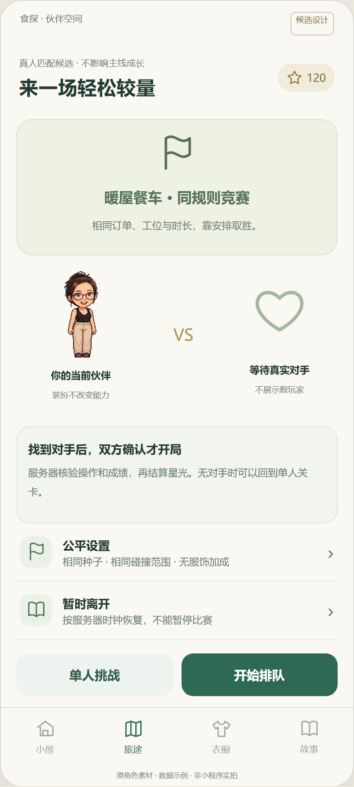

*图13｜可选匹配：明确真人、规则与等待状态。候选设计示意，沿用现有原角色素材；非原生实拍。*

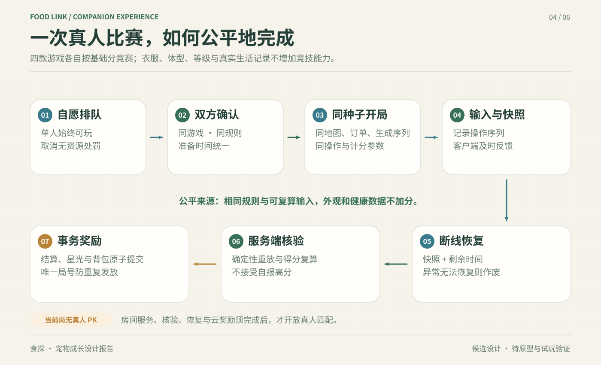

*图14｜真人PK的同种子、输入、恢复、核验与奖励流程。候选机制示意，非原生实拍；当前本机单人游戏没有真人匹配或服务端对局奖励。*

### 9.2 交易异常与迁移的可见状态

| 状态 | 用户可见结果 | 持久化要求 |
| --- | --- | --- |
| 购买待确认 | 确认按钮只允许一次有效提交，物品保持预览 | 使用交易ID，不预先展示已拥有 |
| 成功响应丢失 | 查询原交易，明确显示核对结果 | 返回原交易；不能再次扣币或发物 |
| 余额不足/商品不兼容 | 显示所差星光或适配原因，允许返回衣橱 | 不扣币，不创建半件物品 |
| 结算保存失败 | 保留本局结果，提供重试入口 | 不宣称奖励已到账，不覆盖旧存档 |
| 双设备同时操作 | 第二笔按最新余额确认，装备按版本处理冲突 | 扣币与入库原子完成；跨账号结果拒绝写入 |
| 迁移待核对 | 旧收藏与外观仍可查看，币额显示对应迁移状态 | 保留原存档备份，结果可查询与恢复 |

正式账本记录来源事件、业务ID、增减量、前后余额、规则版本与时间。来源唯一约束避免重复发币；买入交易同时完成扣币和入库。日/周边界由统一服务端时区决定，跨午夜、设备改日期和切账号不能制造第二份日奖励。

本机转云分三步：先备份并上传身份、外观、收藏与进度；再按账号和宠物核对来源、版本与冲突；最后显示迁移结果。旧已拥有外观和收藏优先保留，重复物品合并权益而不自动折币。可编辑的本机余额不能直接当作可信云余额，需根据可核验事件或明确的迁移补偿方案转换；未经用户知情不能擅自重置余额、清空进度或删除宠物。无法核验时保留本机档案与说明状态，用户仍能看自己的伙伴，需先制定可审核的处理路径再启动迁移。

## 10. 动作资源与工程实施

本章全部为候选实施方案。本轮只产出报告，不修改业务代码、执行迁移或启动服务。现有冒险用Taro View/Image约每40ms更新画面，内部20ms固定步长；已有本机结算、收藏和部分原生操作证据，但统一云档案、完整肢体动作、服务端账本与真人匹配尚未完成，视觉验收仍受截图超时阻塞。

### 10.1 技术边界与角色资源

沿用Taro承载成长、小屋、衣橱、商店与聊天，Go处理身份、内容、核验和交易，PostgreSQL保存档案与账本，COS/CDN提供版本化资源。轻量关卡先做Canvas 2D原型，测试基础库与真实设备；不把浏览器兼容性当作小程序已支持。参照[Taro Canvas官方接口](https://docs.taro.zone/en/docs/apis/canvas/)。若后续需复杂场景，再评估独立Cocos微信小游戏及跳转、身份、存档和发布适配；这不是把引擎直接塞进Taro组件。参照[Cocos微信小游戏发布文档](https://docs.cocos.com/creator/3.8/manual/zh/editor/publish/publish-wechatgame.html)。

所有界面读取同一外观快照：`petId`绑定伙伴，`assetVersion`锁定用户认可形象，`rigType`区分静态/逐帧/骨骼/预渲染，`actionSet`声明可用动作，`compatibility`声明服饰适配，`frameAnchor`保存逐帧锚点与遮挡。首页、聊天、衣橱、游戏和小屋不能分别猜测身份。现有原角色、模板及照片产物应逐项登记可用能力，缺少跑步或围巾适配不能标成完整资产。

照片资源需保留原图和已确认版本，再制作一致的正侧姿态、动作帧或分层稿。QA核对脸、发型、比例、透明边缘、锚点及服饰遮挡；失败回退到该宠物已确认版本和可用动作，并说明待适配，不换成鬼鬼。生成资源先预览确认再设为默认，可恢复原版。原图与衍生稿均受账号访问控制，公开分享使用单独发布资源；按用途保留，用户删除时解除关联、清理私有对象及缓存，不把照片长期混入公开素材库。

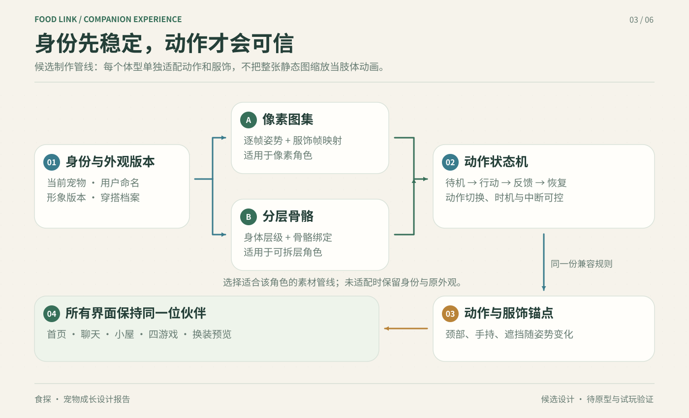

*图15｜身份、资源、状态机与服饰锚点构成统一动作管线。候选制作示意，非原生实拍；像素图集与分层骨骼按角色条件选择，并非新版QQ宠物引擎结论。*

### 10.2 游戏循环与网络边界

原型可保留20ms固定步长，输入带序号、动作和时间戳进入缓冲，渲染按前后状态插值。长帧限制追赶步数，防止页面恢复后突然跑过多段；不足帧时先降粒子、反射与背景效果，保留障碍、计时和输入反馈。场景、动作与服饰按需加载，离页停止循环、解绑触摸并释放资源。加载使用spinner/skeleton，不显示“加载中”文本。

单人切后台冻结时间并保存恢复点；PK继续采用服务器比赛时钟，返回时读取快照，不能靠后台暂停获得优势。候选性能目标是关键玩法稳定30fps、较高性能设备评估60fps、触摸到视觉响应P95不高于100ms，均须真机测量后定版；当前无测量证据，不标注达标。需记录冷启动资源耗时、内存峰值、帧时间及长局热衰减。

### 10.3 服务端模型、接口与状态

关键实体为宠物/外观版本、动作及兼容目录、背包权益/装备快照、章节任务事件、云存档、星光账户/账本、购买交易、游戏局/输入记录、匹配房间/核验结果。余额按账号管理，成长及装备按宠物管理，任务与局号关联规则版本。服务端时区统一日周边界，客户端不能用改时间重新领奖。

| 接口能力 | 候选状态与约束 |
| --- | --- |
| 获取/保存宠物档案 | 返回版本；旧版本写入报冲突，不覆盖新角色 |
| 获取目录/购买/查询交易 | 待确认→成功或失败；超时按原交易ID查询 |
| 创建局/上传输入/提交结果 | 准备→进行→待核验→已结算/作废 |
| 加入/取消匹配/恢复房间 | 排队→配对→确认→准备→进行→核验→结算 |
| 完成生活事件/迁移档案 | 关联真实记录ID；未核验不能声称到账 |

发奖使用唯一来源事件与事务；购买同时扣币和发权益，重复请求返回原结果。服务端必须检查账号、局号、规则版本、输入顺序及可复算成绩，不能接受客户端自报余额或高分。错误区分未登录、版本冲突、余额不足、不兼容、待核验和服务暂不可用；客户端保留待处理事务，避免显示假成功或用空数据覆盖存档。

后端新增结构先落到Go对应模型及`backend/internal/migration/do/schema_do.go`；必要索引、约束、数据修正由迁移代码幂等表达。核对配置实际目标库后，按项目流程运行迁移命令，非本地库需明确授权；HTTP启动不自动迁移。报告不提供临时执行SQL，也不直接改线上表。

匹配首版采用同种子分数竞赛，各自独立操作，低频传对方进度。随机源按逻辑事件序号推进，不由帧率或本地时钟决定；合成双方获得同一类别／等级序列，落点按各自棋盘状态与固定空位排序确定，相同输入必须得到相同棋盘。断线恢复使用原局和剩余时间；服务端故障可作废，主动退出规则公开，异常不得改写对手已核验成绩。候选15秒恢复窗口需弱网试验，不作为已经实现的保证。机器人如引入须标注。规则变化时旧版本不进同局，结果需可重放核验。

AI仅生成有边界的故事表达和白名单动作ID；动作系统检查适配后播放。任务、价格、奖励、胜负与健康评分不由AI自由决定。输出越界、超时或模型失败时显示预写故事与已有动作，规则流程继续可用；故事需引用已发生事件，不能虚构餐食或训练记录。

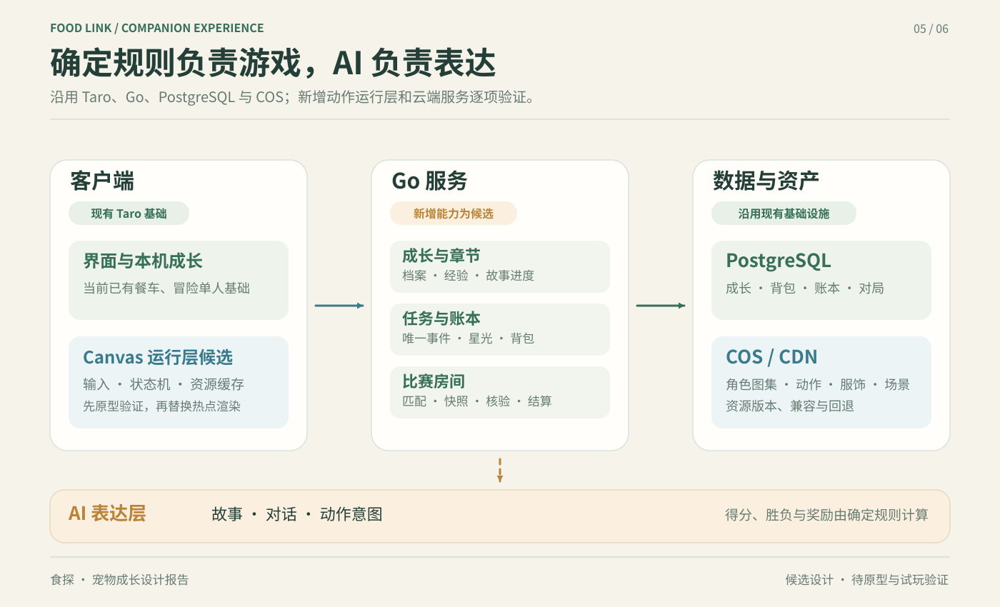

*图16｜沿用基础设施，逐项新增动作运行层与云端能力。候选架构示意，非原生实拍；Taro、Go、PostgreSQL、COS为既有技术基础，Canvas及新增服务模块仍需验证。*

## 11. 实施优先级与交付门槛

优先围绕一位真实伙伴验证身份、服饰与动作，再完成可重访章节与收藏用途；随后建设云档案、账本和生活事件。真人PK先选一款成熟规则做样板，最后扩展到四款完整玩法。

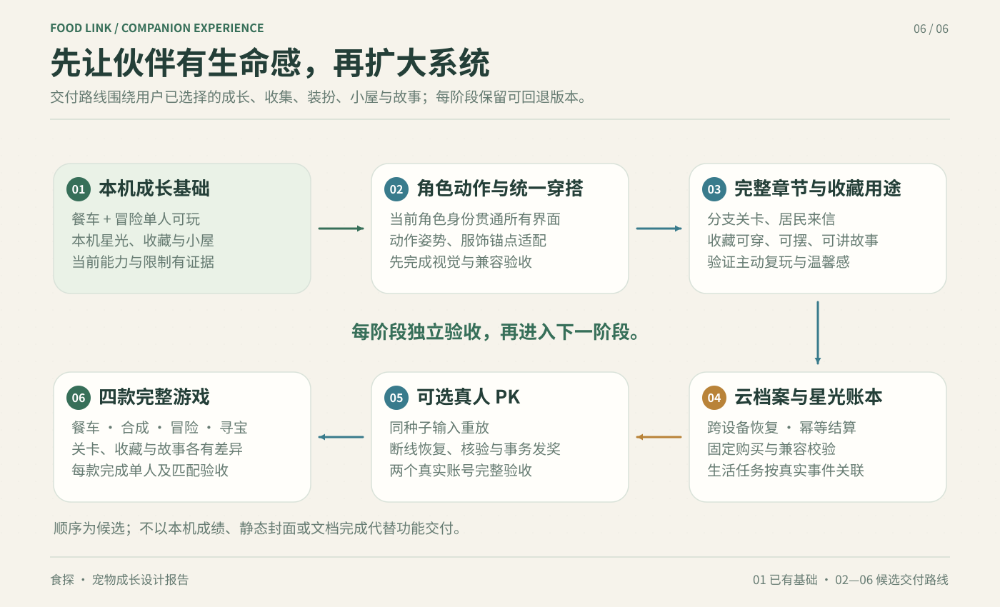

*图17｜从本机基础到动作、章节、云端、PK与四款完整玩法。候选路线示意，非原生实拍；01为已有本机基础，02—06不包含确定发布日期。*

| 阶段 | 主要交付 | 阶段结束必须回答的问题 |
| --- | --- | --- |
| 01 保留本机基础 | 餐车与冒险、收藏与保存范围说明 | 已有能力能否继续稳定使用，旧权益是否保留？ |
| 02 角色动作 | 统一身份、外观版本、基础及玩法动作、服饰锚点 | 用户是否认出同一伙伴，动作与装扮是否同步？ |
| 03 完整章节 | 独立场景、分支、固定收藏、回忆页和小屋结果 | 玩家是否愿意为了下一件具体收藏再次游玩？ |
| 04 云端闭环 | 云档案、迁移核对、账本、交易、生活事件 | 奖励与购买能否在异常和双设备下正确恢复？ |
| 05 单款PK样板 | 真人匹配、同种子、输入核验、断线恢复 | 两个真实账号是否可完成公平、可复算的一局？ |
| 06 四款完整内容 | 补齐不同玩法、关卡与持续内容，推广匹配规则 | 四款是否各有独立乐趣，并通过完整验收？ |

内容与工程可并行，发奖依赖账本，比赛依赖核验。第12章A／B／C／D是验收维度；每款先通过单人验收，再开放该款PK。先做一款匹配样板与后续扩展四款相容。排期按原型、资源产能与真机表现确定，不预设开发工时或发布日期。

## 12. 度量与30项贯通验收

### 12.1 度量、发行与验收

当前没有可引用的用户研究样本量、真实留存或经济分布，不能为报告填入虚构表现。埋点仅记录必要游戏事件与对应记录是否成功保存，分析无需上传健康量数或照片内容。用教学起始者/首次完局者等明确分母，并按新旧用户、游戏、设备和角色适配拆分，避免高频玩家掩盖新手问题。

| 指标 | 可复算定义 | 用于判断 |
| --- | --- | --- |
| 教学完成率 | 24小时内完成教学的用户/开始教学的用户 | 是否理解操作；同时标退出步骤 |
| 第二局主动开局率 | 首次完局后24小时内主动开第二局用户/首次完局用户 | 游戏乐趣；排除系统自动重开 |
| 7日成长回访 | 首次有效事件后第7日有新有效事件用户/符合观察窗口用户 | 回访是否伴随成长；不等同于打开页面 |
| 收藏达成时间 | 首次有效事件到首件自行兑换的活跃日数 | 10/20收益算例是否贴近实际；报中位与分位数 |
| 小屋可见成果率 | 首件领取后24小时内穿戴或摆放用户/首件领取用户 | 收藏是否真的被使用 |
| 生活衔接率 | 游戏后24小时内完成真实记录保存用户/有效完局用户 | 只证明记录行为；区分已有记录习惯用户 |
| PK等待与公平 | 入队到有效开局P50/P90；按游戏及水平段胜率、弃局率 | 等待是否可接受；不能要求每个人50%胜率 |
| 发奖与交易正确性 | 重复请求额外入账笔数、异常扣币未入库笔数、恢复失败数 | 必须为0；发现一次即暂停相关发奖或购买入口 |

先做小规模观察试玩，覆盖新手、普通记录用户、健身爱好者、不同角色和不同性能设备；记录“知道下一步/解释失误/愿意主动再开”的实际证据。乐趣与自然结束通过后，再评估奖励与价格。正式体验指标阈值由试点基线定版，报告不预设不存在的留存成绩。

发行采用四个候选门槛：A完成一个身份、动作、章节、收藏和小屋贯通样本，取得本轮原生截图/录像；B统一档案、云存档、迁移演练、账本与生活事件，重复结算和购买失败恢复全部通过；C补齐其他玩法与持续章节，并证明内容生产可重复；D用两个真实账号验证匹配、公平种子、断线恢复及核验，才宣告真人PK开放。先开放单人内容不会自动完成D。

功能验收至少覆盖不同屏宽、安全区、用户原角色、账号切换、双设备、切后台、无网络、清缓存、交易响应丢失、重复请求、旧规则版本和不兼容服饰。现有104套399项门禁和部分原生操作证据属于上一实现版本；截图超时意味着视觉验收仍未完成。新设计必须建立新的运行与图像证据，不能把渲染图或测试数量当作最终体验已验证。

### 12.2 贯通验收矩阵

以下为待执行标准，共30项，均需记录设备/版本、输入与结果。主路径为“故事触发→动作→游戏→奖励→购买→跨页显示→重登恢复”。截图或录像必须来自本轮原生运行，概念图不能代替证据。

| 编号 | 场景 | 通过标准 |
| ---: | --- | --- |
| 01 | 原宠物进入成长页 | 名字、petId与认可形象一致 |
| 02 | 三种模板切换 | 各自档案与成长不串写 |
| 03 | 照片宠物确认 | 保留源版本并能恢复 |
| 04 | 照片动作QA失败 | 回退同一角色，显示待适配 |
| 05 | 故事首次触发 | 条件命中，事件只登记一次 |
| 06 | 故事分支重开 | 保留已选结果，不重复领奖 |
| 07 | AI越界或超时 | 预写故事接续，规则未被更改 |
| 08 | 基础/解锁动作 | 动作回待机，服饰锚点一致 |
| 09 | 围巾与手持遮挡 | 面部完整，前后层次正确 |
| 10 | 游戏教学进入 | 操作可理解，能返回小屋 |
| 11 | 相同输入重放 | 同规则/种子得到同结果 |
| 12 | 长帧与降画质 | 不跳过关键碰撞和输入 |
| 13 | 单人切后台 | 时钟冻结，恢复点正确 |
| 14 | 页面往返30次 | 无重复循环或持续内存增长 |
| 15 | 有效失败终局 | 按公开规则保留应得成果 |
| 16 | 结算请求重试 | 一局只发一份奖励 |
| 17 | 跨午夜与改设备日期 | 服务端日额度一致 |
| 18 | 两设备同时领奖 | 事件唯一，余额不重复增加 |
| 19 | 商品试穿后取消 | 不扣币，不改变已保存装备 |
| 20 | 不兼容/已拥有商品 | 拒绝重复购买并说明原因 |
| 21 | 余额不足购买 | 余额与背包均未改动 |
| 22 | 购买成功响应丢失 | 查询原交易，仅扣一次 |
| 23 | 双设备同时购买 | 原子扣币，无负余额/半件物品 |
| 24 | 衣橱保存→首页/聊天 | 同一版本穿搭跨页一致 |
| 25 | 摆件保存→重登 | 同账号恢复布局与收藏 |
| 26 | 本机迁云冲突 | 保留备份，未擅自重置用户 |
| 27 | 两真实账号PK | 同种子/时长/判定范围 |
| 28 | PK断线与后台恢复 | 原局继续，无额外操作时间 |
| 29 | PK核验异常/服务作废 | 状态明确，无假奖励和假胜负 |
| 30 | 小屏/安全区/低性能真机 | 按钮无遮挡，取得性能与视觉证据 |

发行先验收一个完整样本，再扩展角色、章节与其他游戏；每款最后开放经过核验的真人PK。日期及开发时长由原型结果和资源产能另行排期，本报告不把候选架构写成已完成交付。

## 13. 附录：来源与规格索引

QQ详细证据等级与不确定项见原调查。以下来源按对象引用，当前食探能力以实现文档与运行证据为准。

| 来源 | 用途与边界 |
| --- | --- |
| [QQ机制与技术调查](../../research/qq-pet-mechanics-and-technology-20261002.md) | 完整公开资料目录、官方／媒体／技术对象区分及食探差距 |
| [腾讯QQ新版宠物公告](https://weibo.com/2/detail/5325249576960481) | 回归、形象与互动能力的官方披露 |
| [成长福袋公告](https://weibo.com/2/detail/5341176760902049) | 成长成果与来访奖励连接；概率与金额未公开 |
| [信息时报公测报道](https://xxsb.gz-cmc.com/pages/2026/07/27/d914754bd0c24f88b0d92604426ef45f.html) | 学习、职业与玩法上手信息；保持媒体属性 |
| [QQ9研发文章](https://developer.cloud.tencent.com/article/2396572) | 品牌企鹅Filament与3D交互参考，不证明新版宠物技术 |
| [腾讯ISUX萌宠动作文章](https://developer.cloud.tencent.com/article/1154194) | 历史QQ空间Spine资源制作参考，不证明新版宠物技术 |
| [腾讯2021年全年业绩公告](https://static.www.tencent.com/uploads/2022/03/23/bdee4ce27bd7ca8e23656c8ebff0b55e.pdf) | 历史超级QQ秀虚幻引擎证据，适用对象独立 |
| [伙伴冒险与成长实现说明](../pet-adventure-20261001/implementation.md) | 现有三章六关、本机60上限、四件商品与保存边界 |
| [餐车单人实现说明](../pet-studio-20261001/kitchen-implementation.md) | 现有六关十二配方、计分、暂停及运行证据限制 |
| [上一轮四游戏设计](../pet-studio-20261001/game-design-plan.md) | 历史方案；最新成长优先级、星光名称与本文冲突时以本文候选设计为准 |
| [Taro Canvas官方接口](https://docs.taro.zone/en/docs/apis/canvas/) | 微信目标环境原型的API参考，不能据此宣称真机达标 |
| [Cocos微信小游戏发布文档](https://docs.cocos.com/creator/3.8/manual/zh/editor/publish/publish-wechatgame.html) | 可选独立小游戏路径，需要另行工程与发布适配 |

资源与图示索引：`figures/`含6张原生SVG机制图；`screens/`含伙伴空间、章节、四游戏、衣橱、故事、匹配、动作册及总览的11张候选图。候选图展示现有原角色素材与设计构图；最终交付必须另外取得本轮微信原生截图或录像，并保留设备、版本、输入与核验结果。
