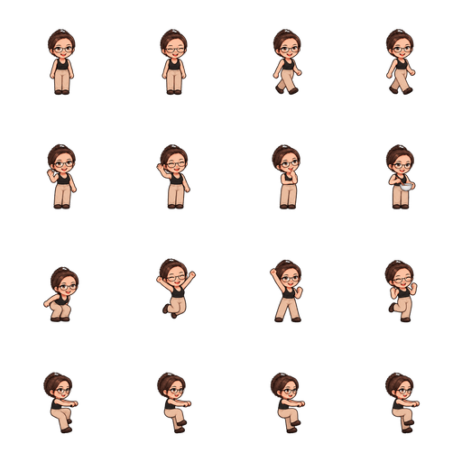
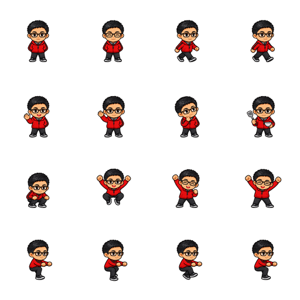

# 完整身躯与专属动作修复

2026-10-03。目标：照片分身保留完整身躯，每个形象拥有自己的动作图集，恢复宠物库中的健文伙伴（用户称“建文”），改善均衡模式骑车。

## 已实现

- 鬼鬼、健文、华佗、太极小子、小麦、豆豆分别使用独立素材，不借用其他角色的动作。
- 每套包含 16 帧，覆盖休息、眨眼、散步、招手、观察、料理、跳跃、庆祝、骑车。观察与料理是各角色专属单帧姿态，其余动作按自己的序列播放。
- 均衡模式骑车使用四个坐姿踩踏帧，取消额外拼接的假手脚；角色踩踏和曲柄同为 800 毫秒一周，返程统一翻转角色与车。原养生模式仍使用既有播放分支。
- 餐车运行场景增加手脚边距，避免完整动作图集在场景底部再次被裁切。
- 公共模板目录在前后端补齐，保留已有候选次序、自定义名字、当前形象及成长。缺失模板可以实际选择并重新读取。
- 照片生成改为完整 4×4 动作图集。保留整个格子，不再按脸部裁切；兼容输出 idle、blink、squash、jump 四张图片。
- 生成结果须通过尺寸、16 格主体、透明边距、站姿轮廓、必要动作帧不重复检查。所有五张图片上传成功后，才替换名字和形象元数据。
- 每次照片生成使用用户专属的新对象前缀；照片动作预览关闭首页形象覆盖。切换角色会替换动作资源，图片不可用时保留该角色原有形象。
- 旧照片分身保持兼容，需要用户重新生成一次才能获得完整动作；没有原照片时不能自动补出可靠的下半身。

## 图集协议

| 行 | 四格从左到右 |
| --- | --- |
| 1 | 休息、闭眼、左脚前迈、右脚前迈 |
| 2 | 招手 A、招手 B、观察、料理 |
| 3 | 蹲下、腾空、庆祝 A、庆祝 B |
| 4 | 骑车曲柄 0°、90°、180°、270° |

内置图集为 512×512 PNG，每格 128×128。源图格线向外读取 32 像素，通过主体连通区域保留跨越名义格线的完整鞋子，再缩放并加入 16 像素透明边距。打包去除与主体断开的碎屑，保留角色及手持道具；使用不抖动的调色板编码，避免压缩放大透明杂点。六套合计约 208 KiB。客户端使用 160% 图层补偿两次打包留白，照片图集则直接按服务端协议播放。

| 角色 | 标志性形象与姿态 | 最终资源 |
| --- | --- | --- |
| 鬼鬼 | 眼镜、黑色背心、米色长裤；思考、料理 | [图集](../../../apps/wechat/src/assets/pets/motions/guigui-motion-v1.png) |
| 健文 | 眼镜、红夹克；运动、锅铲料理 | [图集](../../../apps/wechat/src/assets/pets/motions/jianwen-motion-v1.png) |
| 华佗 | 白须、长袍、草药；整理药篮 | [图集](../../../apps/wechat/src/assets/pets/motions/huatuo-motion-v1.png) |
| 太极小子 | 白练功服、深色裤；稳重蹲跳、捧碗 | [图集](../../../apps/wechat/src/assets/pets/motions/taiji-motion-v1.png) |
| 小麦 | 绿帽、叶纹围裙；食材搭配 | [图集](../../../apps/wechat/src/assets/pets/motions/xiaomai-motion-v1.png) |
| 豆豆 | 白兔、绿贝雷帽；早餐品尝 | [图集](../../../apps/wechat/src/assets/pets/motions/doudou-motion-v1.png) |

## 生成来源与提示词

使用内置 `image_gen`，没有使用 CLI 回退。每个角色单独提供其原始模板或原始鬼鬼图集作为身份参考。第一轮生成，第二轮清理，豆豆追加一次透明碎屑修正。最终 PNG 全部存入上表项目路径。

共同生成规范：同一角色、完整头发至双脚、维持脸型发型眼镜服装与画风、透明背景、严格四列四行，按上表输出 16 个姿态；骑车面向右侧、双手与臀部固定、四个踩踏角度，不画自行车，不增加文字、地面、光效、阴影。角色差异规范分别指定鬼鬼思考与料理、健文运动与料理、华佗草药、太极稳重姿态、小麦食材、豆豆早餐。

清理提示词要求：保持角色身份和全部姿态顺序；删除黑色/彩色/白色碎屑；每格完整主体在中间 76%，四边至少 12% 透明留白；不可跨格或截掉身体；不增加场景。豆豆追加要求保留白色毛发，仅删除兔子轮廓外的碎屑。打包后已逐张目视检查，并自动检查全部 96 格边距与主体存在。

后端生产照片提示词完整保存在 [pixel_avatar_generator.go](../../../backend/internal/pet/service/pixel_avatar_generator.go)，版本协议及校验在 [pixel_motion.go](../../../backend/internal/pet/service/pixel_motion.go)。几何校验不能证明生成模型百分之百保持人脸、解剖和动作语义，仍需真实照片验收。

## 验证和发布边界

后端服务及 handler 包测试通过，覆盖脚部保留、旧四格拒绝、缺格/截边/头像/重复帧拒绝、上传失败保档、模板恢复及重新读取。前端测试覆盖专属资源、切换、暂停、失败回退、骑车不叠加手脚；最终完整测试结果以提交门禁为准。

2026-10-03 已尝试连接微信开发者工具 `ws://127.0.0.1:9423`，连接失败，无法导航、交互或截图。因此此次原生视觉/骑车手脚与车座对齐验收尚未完成，不能将素材检查等同于小程序运行效果验收。样式 Sass 编译通过；未启动或重启用户服务，未运行生产构建，未部署线上后端，也未消费用户照片生成接口额度。

上线需要同步新前后端；新字段存于既有宠物 metadata，不涉及数据库结构迁移。验收顺序：宠物库选择健文 → 返回确认身份 → 原鬼鬼动作/围巾 → 六个角色小屋动作 → 首页收起与召回骑车 → 用真实照片生成与九项姿态预览 → 切页/隐藏/回到前台 → 故障时旧宠物保留。
