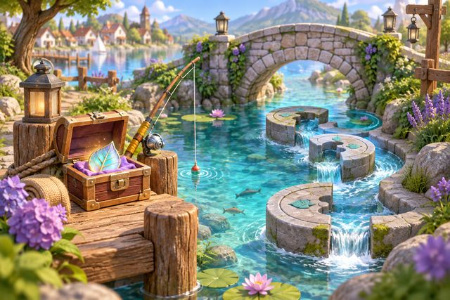

# 从“看成长”改为“想玩一局”

最新调整：按用户要求已移除湖畔餐车与水岸寻宝，当前只保留追风快跑和食材合成局，详见 [游戏精简](./game-removal.md)。下文为此前四款入口的设计记录。

本轮起因是用户反馈四个游戏没有游玩欲望。旧首屏把小屋、等级、心愿说明和入口叠在一起，玩家看不到自己要做什么、何时做以及亲手能赢回什么。本轮改变入口和一款游戏的核心操作，不把换封面称为四款玩法全部重做。

## 首屏与真实开局

首屏先呈现当前用户的伙伴、游戏场景、一个动作说明、本关收藏目标以及开局按钮。四张游戏缩略图可直接切换；点击开局自动进入该伙伴尚未通关的下一关。小屋、换装、等级和故事继续保留在下面及原有导航中。老地图入口与旧深链接仍显示选关准备页。

| 游戏 | 玩家实际操作 | 本轮实现 |
| --- | --- | --- |
| 追风快跑 | 自动跑，点屏幕或按钮起跳 | 新的30秒横向跑跳引擎、金线时机提示、完美连跳、双倍得分、实际收藏与结算 |
| 热闹餐车 | 点订单制作，按火候起锅 | 新场景封面、下一关目标、直接开局；保留真实制作和出餐引擎 |
| 合成餐盘 | 滑动合并食材，选菜并交付 | 新场景封面、下一关目标、直接开局；保留拼盘引擎 |
| 水岸寻宝 | 移动、找线索、转水渠、打捞 | 新场景封面、下一关目标、直接开局；保留探索引擎 |

以上是实际安装包使用的场景插画，非小程序截图。图片不含角色；真实角色和穿戴跟随程序中的选择。

## 快跑规则

- 每关30秒，自动前进，无手动前移、路线选择或中途继续按钮。第一个障碍约1.8秒后到达，金线给出清楚的输入时机。
- 起跳850毫秒，空中连点不重复起跳。障碍中心到金线时点击即可在接触前达到最高点。
- 连续三次完美跳触发5秒双倍基础分；普通成功跳或碰撞中断蓄力。最高连击另计，帮助玩家追求自己的纪录。
- 三次碰撞结束本局。第4、8、12个障碍带本关各一件真实纪念，成功越过才入背包；后续失败仍保留已拿到的纪念。
- 六关按不同障碍间隔推进，最短间隔1.4秒，足够落地再起跳。石头和树根目前用相同跳跃判定；六关不是六种不同机制。
- 无人操作不会得分、领取收藏或奖励。前台长帧按真实时间推进，逐10毫秒判定交叉，后台暂停后须点击继续。

## 收获回家

大厅优先预告本关未拥有的冒险收藏；都拥有时提示纪录与三星目标。冒险物品的名称以ID为准，同一收藏在不同关卡保持同一个名字。叶片和旅行页用对应图标；它们可以在收藏页真的摆到小屋，非仅结算文案。

本机星光仍采用既有规则：各游戏每天首次有效游玩6星光，四款共24星光；重复玩仍可收集、通关和刷新成绩。没有提高发行量，也没有将游戏分数当成健康数据、真实运动记录或AI积分。结算沿用账号及宠物隔离存档、局号去重、失败重试；未保存时禁止再开与退出。

## 验证与边界

纯引擎测试覆盖六关实际跳跃通关、收藏、失败保留、连续完美、长帧、暂停、连点和零输入。组件与真实hub测试覆盖首屏开局、身份切换、保存失败复用局号、回收藏及摆放。

原生验证和最终质量门禁结果记录在同目录的验收记录中。生成提示词、压缩尺寸与资产来源见 [素材记录](asset-prompts.md)。

本轮没有新增真实匹配PK、云端代币账本或三款其他游戏的新核心机制。自行车真实连续踩踏、滑板车蹬地动作及真实照片的完整身躯/专属动作验收，仍是先前批准工作中的后续项；没有用这次游戏修改代替那些验收。养生模式与均衡模式八套主题保持既有范围。

接下来的试玩关注三个行为：不读教程能否完成第一跳，拿到纪念是否想带回小屋，以及是否主动再开一局。当前代码和视觉改变不能证明用户一定觉得好玩，不能以“上瘾”作为已实现的验收结论。
