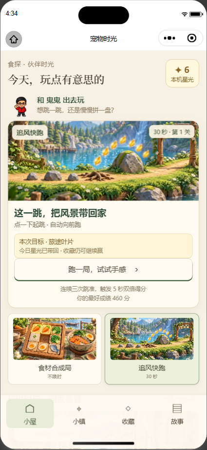

# 伙伴游戏精简

按用户最新要求，移除「水岸寻宝」「湖畔餐车」。当前可玩内容为「追风快跑」「食材合成局」。本页覆盖此前四款游戏的入口方案。

- 大厅选项、小镇地图和游戏卡片只显示两款；旧餐车页面重定向大厅，旧 `game=kitchen` / `game=explore` 参数不再启动游戏。
- 成长三章改为快跑、合成、摆放纪念和阅读前章即可完成；已有旧目标进度仍被承认，已完成章节可重读与更换选择，不重复领取经验或故事页。
- 新心愿只提供现有两款的六枚徽章，计数只统计这六枚。已获得的旧徽章和纪念仍保留名称并可摆放；旧心愿记录保留，但不继续展示无法完成的追踪目标。
- 既有星光、库存、摆放、旧成绩、通关、地标、徽章进度、章节选择、迁移记录和已结算局号保持原存档结构。历史游戏 ID 与徽章目录只用于兼容，不能新增旧游戏结算或心愿。
- 星光维持每款每日首次有效游玩六枚，当前两款新日合计十二枚。历史当天已领取的四款记录与最多二十四枚的累计值完整保留，避免补发或扣减。

已通过 TypeScript；定向检查共八十一项（存档修正后该套三十三项复跑通过，其余三套四十八项通过）。覆盖移除入口、旧路由与参数、剩余游戏开局、完整旧存档写回、旧局号幂等、历史徽章摆放、六枚当前徽章计数及章节完成。

微信开发者工具自动化连接、跳转伙伴页面和当前路由读取成功。页面完成渲染后，实际查询确认快跑与合成入口存在、餐车与寻宝入口不存在，随后完成合成开局、暂停、返回大厅，取得本次真实截图。第一次过早截图曾超时，后续页面就绪后成功；不是仍然未连通。

完整提交门禁通过：TypeScript、ESLint、暂存 diff 与敏感文件检查，以及一百二十一个测试套件、六百五十四项测试全部通过。源码提交 `4df396ee`；截图与最终验收说明另作同分支文档提交。
