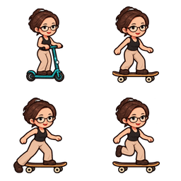
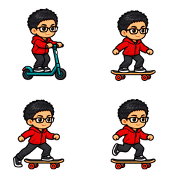
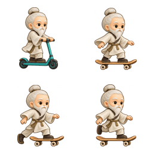
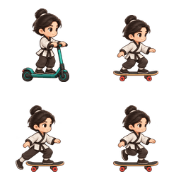
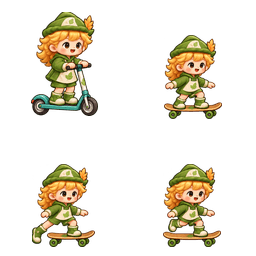
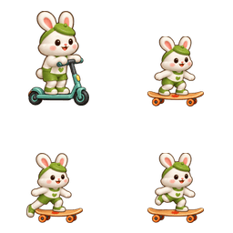

# 宠物出行工具 · 第一批

用户确认第一批使用自行车、滑板车和滑板。此版为六个内置形象分别提供素材，接入均衡模式首页出发/返回，并在伙伴时光提供免费试骑与确认入口。

## 使用入口与动作

进入宠物聊天里的「伙伴时光」，点击小屋的「选一辆出行工具」，或直接打开「收藏」顶部的「出行工具」。点击工具只预览；「确认出行工具」才写入本机选择。回到均衡模式首页，收起/叫回宠物或滚动触发出行，使用已选工具。一趟移动过程中不会突然更换车辆。

| 工具 | 这一版的实际动作 | 适配方式 |
| --- | --- | --- |
| 自行车 | 坐姿滑行，轮子持续转动；脚踏保持稳定 | 每个宠物自己的坐姿与手、座位、脚锚点；完整闭合车架 |
| 滑板车 | 双手握把、双脚站在踏板，轻微重心变化 | 每个形象独立绘制人物与车的完整姿态，作为整体移动 |
| 滑板 | 蹬地 → 收脚 → 双脚滑行，1500ms 循环 | 每个形象独立三个姿态，固定板中心与轮子落地高度 |
| 散步 | 当前宠物自己的已有步行动作 | 保留原穿搭；没有对应动作时保留原形象 |

自行车现在是**滑行**，没有宣称连续蹬踏；滑板车是一张站姿配轻微重心变化，没有宣称四相位蹬地动画。新骑行姿态暂不叠加围巾，已保存衣装保留，回到静止/散步后使用。

## 六个角色的独立素材

每张透明 2×2 图集依次为：左上滑板车、右上滑板滑行、左下蹬地、右下收脚。鬼鬼按用户曾确认的原女性形象绘制，不按云端同名但不同形象的模板替换。

| 原鬼鬼 | 健文 | 华佗 |
| --- | --- | --- |
|  |  |  |

| 太极小子 | 小麦 | 豆豆 |
| --- | --- | --- |
|  |  |  |

这些是程序使用的动作素材，不是小程序运行截图。

## 身份、存档与失败处理

- 选择以 `pet_transport_v1:账号:宠物ID:编码后的实际形象` 单独保存，不修改成长、星光、游戏成绩或穿搭存档。普通清除缓存保留这类本机存档。
- 页面隐藏、档案变化或账号切换后，旧页面不能确认写入。读取缺失/损坏选择只返回默认值，不自动写盘。
- 试骑与首页移动共用 `PetTransportActor`，整体舞台缩放，手、脚、车架不分别缩放；适配不同模拟器屏宽。
- 新工具素材失败时退回同一宠物的步行/原图，不借用其他角色。暂停保留姿态、停止动画；减少动态效果设置关闭动画。
- 仅均衡模式首页改用新工具，养生模式原分支保留。原冒险游戏的星光兑换 `leafboard` 是独立道具，不被免费基础出行工具覆盖。
- 照片伙伴的旧 v1 动作协议没有滑板车和滑板姿态，也没有可测量的自行车接触点。这些选项明确禁用，先保留该照片伙伴自己的散步/静态形象；本轮未调用真实照片收费生成、未改后端协议。

## 生成与打包记录

生成模式：内置 `image_gen`，透明背景，每个角色单独以其已有动作图集作为身份参考。原输出保留在 Codex `generated_images/01a0986d-3233-7d01-8863-a9c14aab25f2/`，项目交付使用 `apps/wechat/src/assets/pets/transport/*-transport-v1.png`。

| 角色 | 原输出文件 |
| --- | --- |
| 鬼鬼 | exec-6b57ee83-4276-429f-9ee5-79f2562b1029.png |
| 健文 | exec-79ee83fc-7a4d-4451-941f-a3bb729db404.png |
| 华佗 | exec-69093ff4-1934-4d84-91ff-f43ecc71eb5e.png |
| 太极小子 | exec-d1dfbfa8-42bf-4253-a261-eff2ea28f2e3.png |
| 小麦 | exec-80306a0f-44ac-428a-9ece-907d2b2f3244.png |
| 豆豆 | exec-19ef4eb9-7be1-4992-a0be-0b448f528278.png |

提示要求保留角色脸、发型、服装、比例与像素画风，身体完整含双脚、双手与工具，固定镜头，面向右；不添加其他角色、独立假手脚、文字或背景。左上青绿色滑板车站姿，右上木质滑板双脚滑行，左下后脚蹬地，右下后脚收回；后三格保持上身、前脚和滑板位置稳定。华佗收起原手持物，兔子的耳朵完整保留。

`scripts/pack-pet-transport-assets.cjs` 只做图集格式打包：分格、透明边界裁切、三格同一比例、按板中心和轮底对齐、量化 PNG。没有用代码创造人物或肢体。最终六张 256×256 图集共约 97KiB，具体尺寸、体积、锚点与边距见 `packing-v1.json`。

## 验证状态

代码与像素检查涵盖六个角色素材、四帧差异/透明边距、真实轮底相位差不超过一个素材像素、身份与账号隔离、免费试骑/确认保存、失败回退、散步衣装、首页真实出发返回和普通缓存清理。提交前必须通过项目强制暂存快照门禁。

微信开发者工具需要对本版界面继续实拍验证，不能以素材检查或单测替代最终动画观感验收。本轮原生检查结果与最终测试数量将在完成后补录。
