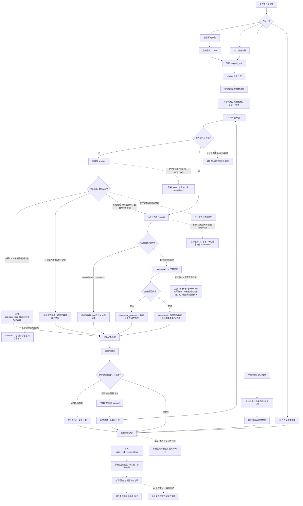

# 食物记录主链路流程图

这张图描述用户记录一餐时的主要路径、后端算法流程，以及需要 benchmark、优化或数据治理的关键环节。

标记说明：

- `[B]` 需要 benchmark
- `[O]` 需要优化
- `[D]` 需要数据治理

## 这次 0 卡问题的位置

饭饭这次不是分享页算错，而是 `user_food_records.items` 已经保存了错数据：

- `如实酸奶`：普通库和包装库都没命中，最后以 `unresolved + 0营养` 保存。
- `双汇玉米热狗肠`：包装库有正确 SKU，但当时停在 `candidates_only`，没有把候选营养应用进去，也没有兜底。

## 最需要 Benchmark 的点

1. 包装库召回 benchmark：防错 SKU、错规格、弱 fuzzy、品牌/口味误命中。
2. 标准营养库召回 benchmark：防品牌酸奶、口语名、单位短语 unresolved。
3. 保存前 0 营养门禁：非真实零卡食品不能保存成 0。
4. 结果页到保存链路回归：防结果页有营养、保存后字段丢失。
5. 真实任务审计：定期扫描 `analysis_tasks` / `user_food_records` 中非零卡食品的 0 营养记录。

核心原则：候选不能当命中，包装库未命中不能直接结束；应继续标准营养库，再 DeepSeek/LLM 兜底。未命中不能静默保存 0，品牌化普通食物必须能安全退回通用营养库。
